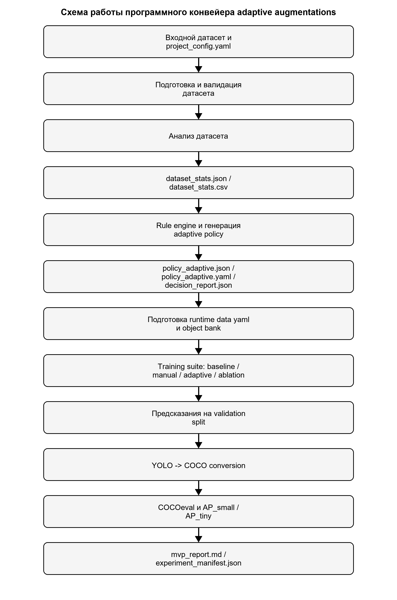

# Полный регламент написания текста ВКР

Данный файл является сводным и приоритетным набором правил для написания, редактирования, проверки и сборки текста выпускной квалификационной работы по текущему проекту `small_objects_auto_aug`. Документ объединяет требования, которые были заданы пользователем в переписке, а также правила, зафиксированные в файлах каталога `diploma/`, в рабочей документации проекта и в локальных материалах по оформлению. Дополнительно в рабочий контур вручную интегрированы практические правила и автоматизационные элементы из репозитория `vkr-author`, прежде всего файл `docs/lessons-learned.md` и скрипт `scripts/inject-titlepage.py`. (источник: diploma/docs/writing-prompt.md; diploma/docs/style-guide.md; diploma/README.md; diploma/source-materials/formatting-rules/README.md; diploma/docs/lessons-learned.md; diploma/scripts/inject-titlepage.py)

Документ нужно использовать как главный регламент в тех случаях, когда требуется написать новый раздел, отредактировать существующий текст, подготовить рисунки, таблицы и формулы, оформить ссылки на литературу, привести материал к единому стилю или собрать итоговый `.docx` по шаблону. Если краткие инструкции в других файлах совпадают не полностью, приоритет имеет этот документ, а внутри него более высокий приоритет имеют разделы о точности источников, ссылках, URL и официальном стиле. (источник: diploma/docs/writing-prompt.md; diploma/docs/style-guide.md)

Практические anti-patterns и частные проверки, появившиеся после изучения `vkr-author`, не отменяют настоящий регламент, а дополняют его. Если требуется быстро проверить частую ошибку оформления, сначала имеет смысл свериться с `docs/lessons-learned.md`, а затем уже применять общий набор правил из настоящего документа. (источник: diploma/docs/lessons-learned.md)

## 1. Назначение документа

Цель данного регламента состоит в том, чтобы обеспечить единый, воспроизводимый и контролируемый процесс подготовки текста ВКР: сначала в `Markdown`, затем в `Word` по шаблону. Все разделы диплома должны писаться так, чтобы их можно было без концептуальной переделки перенести в итоговый документ, сохранить академический стиль, не потерять источники, не исказить смысл использованных материалов и не нарушить требования по оформлению. (источник: diploma/README.md; diploma/docs/writing-prompt.md; diploma/docs/style-guide.md)

Практически это означает, что любой новый текст должен быть одновременно: содержательно корректным, опирающимся на проверяемые источники, структурно согласованным с текущим планом ВКР, стилистически единообразным, пригодным для сборки в `.docx`, а также совместимым с уже созданными файлами в `diploma/text/`. (источник: diploma/docs/narrative.md; diploma/docs/writing-prompt.md; diploma/README.md)

## 2. Область действия

Правила данного файла распространяются на все текстовые материалы, связанные с дипломом: главы в `diploma/text/*.md`, служебные описания разделов, внутренние инструкции для генерации текста, тематические пакеты, промежуточные черновики, таблицы, подписи к рисункам, блоки со списками источников, а также тексты, которые затем переносятся в Word-документ. Исключение составляют только чисто технические скрипты сборки, однако даже они должны учитывать изложенные здесь требования к структуре и оформлению текста. (источник: diploma/README.md; diploma/docs/topic-brief-template.md; diploma/docs/style-guide.md)

Отдельно важно, что правила распространяются не только на основной дипломный текст, но и на все сопровождающие инструкции. Это сделано намеренно: пользователь отдельно потребовал, чтобы требования не распадались на разрозненные сообщения и локальные заметки, а были сведены в единый подробный документ, которым можно пользоваться как устойчивым промптом и как внутренним стандартом проекта. (источник: пользовательские требования из переписки; diploma/docs/writing-prompt.md)

## 3. Приоритет требований

Если между разными указаниями возникает конфликт, приоритет требований определяется следующим образом. На первом месте всегда стоит фактическая точность и недопустимость искажения источников. На втором месте стоят прямые пользовательские требования из переписки, особенно требования о ссылках после каждого абзаца, обязательности URL, сохранении смысла источников и использовании структуры `diploma/`. На третьем месте находятся требования локальных файлов `diploma/docs/*.md`. На четвертом месте находятся примеры из `source-materials/examples/` и `source-materials/prior-work/`, которые задают форму, композицию и академическую интонацию, но не могут подменять фактическую базу текущего проекта. (источник: diploma/docs/writing-prompt.md; diploma/docs/style-guide.md; diploma/source-materials/formatting-rules/README.md; diploma/source-materials/examples/ВКРБ_МаршунинаМА.docx; diploma/source-materials/prior-work)

Если источник, пример или локальная инструкция позволяют несколько вариантов оформления, следует выбирать тот вариант, который лучше согласуется с шаблоном `blank-template.docx`, с уже написанными главами и с образцом дипломной работы из папки `examples`. Это правило помогает избегать стилистической мозаики, когда отдельные главы формально правильны, но визуально и композиционно выглядят как тексты из разных документов. (источник: diploma/docs/style-guide.md; diploma/template/blank-template.docx; diploma/source-materials/examples/ВКРБ_МаршунинаМА.docx)

## 4. Базовые принципы написания

Любой текст для диплома должен писаться на русском языке, в официальном, академическом и безличном стиле. Допустимы устойчивые технические английские обозначения, если они уже закреплены в проекте или в научных источниках, однако они должны вводиться осмысленно и по возможности сопровождаться русскоязычным эквивалентом или пояснением. Разговорные обороты, публицистическая манера, эмоциональные оценки без доказательства и авторские реплики от первого лица не допускаются. (источник: diploma/docs/style-guide.md; diploma/docs/glossary.md; diploma/docs/writing-prompt.md)

Текст должен быть не просто “правильным по тону”, а полезным для раскрытия темы текущей ВКР. Это означает, что каждый раздел обязан работать на общую сюжетную линию: проблема детекции малых объектов, ограничения обычных аугментаций, необходимость адаптивного выбора, место текущего проекта, его реализация и экспериментальная проверка. Даже краткие теоретические отступления должны быть функциональными и подводить к основной теме, а не расползаться в универсальный учебник по компьютерному зрению. (источник: diploma/docs/narrative.md; пользовательские требования из переписки)

Нельзя оставлять в тексте заглушки, поврежденные символы, “????”, следы неудачной кодировки, оборванные формулы, пустые подписи к рисункам, неразрешенные маркеры вроде `TODO` или черновые комментарии. Пользователь отдельно потребовал проверять все символы, изображения и подписи к таблицам, поэтому финальная версия каждого раздела должна быть не черновой заметкой, а аккуратным академическим текстом. (источник: пользовательские требования из переписки; diploma/docs/writing-prompt.md)

## 5. Источниковая база

При написании текста необходимо опираться одновременно на несколько классов источников: код и документацию текущего проекта, материалы каталога `diploma/`, образцы и предыдущие работы, а также внешние научные и прикладные источники, собранные в `diploma/docs/sources.md`. Каждый новый раздел должен строиться только после того, как для него определена достаточная фактическая база. Если подтверждений не хватает, текст нельзя “додумывать”; нужно сначала найти опору в локальных файлах или в уже зафиксированном списке внешних источников. (источник: diploma/docs/writing-prompt.md; diploma/docs/sources.md; diploma/README.md)

Основными локальными источниками по проекту являются: `README.md`, `docs/DATASET_ANALYTICS.md`, `docs/AUGMENTATION_POLICY.md`, `docs/THRESHOLDS.md`, `configs/*.yaml`, модули в `src/`, тесты в `tests/`, а также артефакты экспериментов в `artifacts/`, если раздел касается результатов, smoke-сценариев, policy generation или метрик. При описании конкретной реализации желательно ссылаться на как можно более точный локальный источник, например на конкретный файл или подмодуль, а не только на общий каталог. (источник: diploma/docs/writing-prompt.md; diploma/docs/sources.md; README.md)

Основными локальными источниками по самому диплому являются: `diploma/docs/style-guide.md`, `diploma/docs/narrative.md`, `diploma/docs/glossary.md`, `diploma/docs/sources.md`, `diploma/docs/topic-brief-template.md`, `diploma/docs/writing-prompt.md`, `diploma/template/blank-template.docx`, а также PDF-файлы из `diploma/source-materials/formatting-rules/`. Эти файлы задают структуру работы, терминологию, стиль, правила библиографии и логику сборки. (источник: diploma/README.md; diploma/docs/style-guide.md; diploma/source-materials/formatting-rules/README.md)

Образцы из `diploma/source-materials/examples/` и `diploma/source-materials/prior-work/` используются как эталоны композиции, академической плотности, переходов между частями и общего ощущения “нормоконтрольного” документа. Однако они не являются фактическими источниками по теме текущего проекта и не могут заменять научные статьи, код или документацию. Их следует использовать как образцы подачи материала, а не как готовый контент для заимствования. (источник: diploma/docs/writing-prompt.md; diploma/source-materials/examples/ВКРБ_МаршунинаМА.docx; diploma/source-materials/prior-work)

## 6. Абсолютное правило о ссылках

Для любого дипломного текста действует жесткое правило: после каждого смыслового абзаца должна стоять ссылка на источник или набор источников. Пользователь формулировал это требование отдельно и неоднократно, поэтому абзац без источника считается недопустимым, даже если его содержание кажется очевидным. Это правило распространяется на введение, теоретические главы, описание проекта, архитектуру, реализацию, экспериментальную часть, заключение и подписи к таблицам и рисункам. (источник: пользовательские требования из переписки; diploma/docs/writing-prompt.md)

Если абзац основан на внешней литературе, в конце абзаца должна стоять числовая ссылка вида `[N]`, `[N, M]`, `[N, с. X]` или `[N, p. X]` в зависимости от ситуации. Если абзац описывает код текущего проекта, конфигурации, тесты, артефакты или локальные документы, в конце абзаца должна стоять явная локальная ссылка вида `(источник: src/pipeline_mvp.py)` или `(источник: docs/AUGMENTATION_POLICY.md; src/policy/rule_engine.py)`. Если абзац синтезирует внешнюю литературу и локальную реализацию одновременно, допускается комбинированный формат, например: `[4, 7] (источник: src/policy/rule_engine.py; docs/AUGMENTATION_POLICY.md)`. (источник: diploma/docs/writing-prompt.md; diploma/docs/style-guide.md)

Пример правильного оформления абзаца на литературной основе:

```md
Аугментация данных позволяет искусственно расширять обучающую выборку и снижать чувствительность модели к ограниченности исходных наблюдений, что особенно важно в задачах обнаружения объектов на сценах с высокой вариативностью масштаба и освещенности. [5]
```

Пример правильного оформления абзаца на локальной проектной основе:

```md
В текущем проекте adaptive policy формируется после вычисления статистик датасета и преобразуется в набор параметров, совместимых с тренировочным конвейером Ultralytics YOLO, а также в `decision_report.json`, объясняющий сработавшие правила. (источник: src/policy/rule_engine.py; src/augmentation/policy_to_ultralytics.py; docs/AUGMENTATION_POLICY.md)
```

Пример правильного смешанного оформления:

```md
В отличие от search-based подходов к выбору аугментаций, rule-based схема текущего проекта строит интерпретируемую политику на основе статистик датасета и делает явными причины выбора параметров для dense small-object сцен. [3, 4] (источник: src/policy/rule_engine.py; docs/AUGMENTATION_POLICY.md)
```

## 7. Правило о списке источников в конце каждого тематического файла

После любого изменения тематического файла в `diploma/text/*.md` в конце этого файла должен находиться отдельный подраздел `## Источники раздела`. В этом подразделе перечисляются все внешние и локальные источники, реально использованные при написании именно данного файла. Это правило было введено отдельно по запросу пользователя и должно соблюдаться всегда, даже если раздел пока черновой. (источник: пользовательские требования из переписки; diploma/docs/writing-prompt.md)

Блок `Источники раздела` нужен не для красоты, а для трассируемости. Он позволяет быстро проверить, на чем основан раздел, не потерялись ли URL, какие локальные файлы использовались, и что именно придется перепроверять при будущей редактуре. При сборке `.docx` этот блок может исключаться техническим скриптом, но в `Markdown` он обязан оставаться в актуальном состоянии. (источник: diploma/docs/writing-prompt.md; diploma/scripts/build_docx_local.py)

Рекомендуемый шаблон:

```md
## Источники раздела

- `[3]` AutoAugment: Learning Augmentation Policies from Data. URL: https://arxiv.org/abs/1805.09501
- `[4]` Scale-Aware Automatic Augmentation for Object Detection. URL: https://arxiv.org/abs/2103.16119
- `docs/AUGMENTATION_POLICY.md`. Использован для описания логики rule-based policy.
- `src/policy/rule_engine.py`. Использован для подтверждения реализованных правил и выходных артефактов.
```

## 8. Обязательность и корректность URL

Для каждого внешнего электронного источника обязательно нужно указывать полный URL. Пользователь отдельно потребовал, чтобы URL были не просто формально добавлены, а были правильными, открывались и вели именно на тот материал, на который идет ссылка в тексте. Поэтому сокращенные ссылки, неустойчивые промежуточные редиректы, неявные агрегаторы, внутренние поисковые страницы или битые адреса недопустимы. (источник: пользовательские требования из переписки; diploma/docs/writing-prompt.md; diploma/docs/sources.md)

Правильный URL должен удовлетворять четырем условиям: быть полным, иметь вид `https://...`, вести прямо на нужную статью, документацию или PDF, соответствовать записи в `diploma/docs/sources.md`, а также сохраняться в списке источников раздела и в финальном библиографическом списке. Если источник меняется, URL нужно обновить везде последовательно. (источник: diploma/docs/sources.md; diploma/docs/style-guide.md; diploma/source-materials/formatting-rules/правила_оформления_источников.pdf)

Пример правильной записи:

```md
- `[10]` The Power of Tiling for Small Object Detection. URL: https://openaccess.thecvf.com/content_CVPRW_2019/papers/UAVision/Unel_The_Power_of_Tiling_for_Small_Object_Detection_CVPRW_2019_paper.pdf
```

Пример неправильной записи:

```md
- `[10]` Статья про tiling. URL: cvf.com/paper
- `[10]` Статья про tiling. URL: https://bit.ly/...
- `[10]` Статья про tiling. URL: страница поиска Google
```

## 9. Недопустимость искажения источников

Текст источника нельзя искажать. Допускается перевод с английского языка на русский, уплотнение синтаксиса, перестройка порядка слов, объединение нескольких близких утверждений в один абзац, но при этом должны сохраняться исходные смысл, ограничения, условия применимости, количественные значения, формулировки об осторожности и характер выводов. Если статья пишет о тенденции, нельзя превращать это в доказанный универсальный закон. Если работа проверялась только на конкретном датасете, нельзя писать так, будто результат уже доказан для всех задач детекции. (источник: пользовательские требования из переписки; diploma/docs/writing-prompt.md)

Если в источнике присутствуют численные значения, названия метрик, архитектурные ограничения, экспериментальные условия, список допущений или оговорки, они должны сохраняться и при пересказе. Особенно строго это правило действует для описания научных статей, правил аугментации, метрик `AP_small` и `AP_tiny`, а также при переносе таблиц и формул. (источник: diploma/docs/writing-prompt.md; diploma/docs/sources.md)

Неправильно:

```md
В работе показано, что copy-paste всегда улучшает качество детекции.
```

Правильно:

```md
В работе по copy-paste показано, что перенос объектов между изображениями может давать сильный практический эффект, однако корректность такого приема зависит от способа представления объекта и от условий его размещения в новой сцене. [9]
```

## 10. Терминология

Во всех разделах необходимо придерживаться единой терминологии, зафиксированной в `diploma/docs/glossary.md`. Например, `small object detection` следует переводить как “детекция малых объектов”, `tiny objects` – как “сверхмалые объекты”, `augmentation policy` – как “политика аугментаций”, `rule engine` – как “механизм правил”, `object bank` – как “банк объектов”, `tiling` – как “тайлинг”, а `COCOeval` и `AP_small` лучше сохранять как устоявшиеся технические обозначения. (источник: diploma/docs/glossary.md)

Если термин используется впервые, желательно дать его полную форму или краткое пояснение. Если в разделе много сокращений, они должны быть согласованы с файлом `00b-abbreviations.md`. Нельзя в одной главе писать “малые объекты”, а в другой внезапно переключаться на “небольшие экземпляры объектов” или “объекты малого масштаба”, если это не требуется специально для смыслового различия. (источник: diploma/docs/glossary.md; diploma/text/00b-abbreviations.md; diploma/docs/style-guide.md)

## 11. Общая структура диплома

Структура текущей ВКР должна соответствовать логике, закрепленной в `diploma/docs/narrative.md`, и уже подготовленному набору файлов `diploma/text/`. Рабочая последовательность разделов такова: титульный лист, реферат, при необходимости перечень сокращений, введение, теоретическая и обзорная часть, постановка задачи, архитектура, реализация, план экспериментов, экспериментальная глава, заключение, список использованных источников и приложения. (источник: diploma/docs/narrative.md; diploma/README.md; diploma/text)

Внутри текущего проекта это уже выражено отдельными файлами:

```text
diploma/text/00-titlepage.md
diploma/text/00b-abbreviations.md
diploma/text/01-intro.md
diploma/text/02-review.md
diploma/text/03-requirements.md
diploma/text/04-architecture.md
diploma/text/05-implementation.md
diploma/text/06-experimental-design.md
diploma/text/07-experiments.md
diploma/text/08-conclusion.md
diploma/text/09-references.md
```

Пользователь отдельно потребовал, чтобы каждый тематический блок находился в отдельном файле. Это означает, что новые темы, подглавы или крупные разделы не следует смешивать в один большой черновик. Если пишется новый фрагмент, для него должен быть определен собственный целевой `.md`-файл или заранее согласованное место внутри существующего тематического файла. (источник: пользовательские требования из переписки; diploma/README.md)

## 12. Структура отдельного раздела

Перед написанием каждого нового раздела необходимо определить: место раздела в общей композиции диплома, его цель, набор тезисов, обязательные источники, обязательные локальные материалы проекта, рисунки, таблицы, формулы и предполагаемый объем. Для этого рекомендуется использовать шаблон `diploma/docs/topic-brief-template.md`, чтобы еще до генерации текста было понятно, что именно должен доказывать или объяснять раздел. (источник: diploma/docs/topic-brief-template.md; diploma/docs/writing-prompt.md)

Минимально корректный порядок работы выглядит так:

1. Определить файл раздела.
2. Определить его место в логике диплома.
3. Подобрать и зафиксировать источники.
4. Подобрать рисунки, таблицы и формулы.
5. Написать текст с обязательными ссылками после абзацев.
6. Добавить блок `Источники раздела`.
7. Проверить символы, подписи, URL и совместимость со сборкой в Word. (источник: diploma/docs/topic-brief-template.md; diploma/docs/writing-prompt.md)

## 13. Стиль изложения

Стиль должен быть официальным, академическим и нейтральным. Предпочтительны конструкции вида “в работе рассматривается”, “в проекте реализован”, “в качестве критерия используется”, “проведенное сравнение показывает”, “полученные результаты свидетельствуют”. Не допускаются обороты “я сделал”, “мы решили”, “кажется”, “в принципе”, “довольно неплохо”, “прикольный результат”, “как известно” без источника. (источник: diploma/docs/style-guide.md; diploma/docs/writing-prompt.md)

Абзацы должны быть логически завершенными. Один абзац – одна законченная микромысль, подтвержденная источником. Нежелательно делать абзацы длиной в одно предложение, если это не подпись, определение или очень короткое связующее утверждение. Но так же нежелательны и перегруженные абзацы, в которых смешиваются теория, сравнение литературы, детали реализации и выводы по экспериментам сразу. (источник: diploma/docs/style-guide.md; diploma/source-materials/examples/ВКРБ_МаршунинаМА.docx)

Текст должен быть “плотным, но читабельным”. Это означает, что в нем не должно быть пустых общих фраз вроде “в современном мире технологии играют большую роль” или “компьютерное зрение является актуальным направлением”. Каждая общая фраза должна быстро переходить к конкретике, связанной с малой детекцией, аугментацией, overhead/UAV-данными, архитектурой проекта или экспериментами. (источник: diploma/docs/narrative.md; diploma/source-materials/examples/ВКРБ_МаршунинаМА.docx)

## 14. Заголовки

Заголовки в `Markdown` должны оставаться без ручной цифровой нумерации. Нумерация в финальном Word-документе должна обеспечиваться стилями и шаблоном, а не текстом заголовка. Поэтому правильно писать `# Введение`, `## Актуальность темы`, `# Архитектура программного конвейера`, а неправильно – `# 1 Введение` или `## 2.1 Актуальность темы`. (источник: diploma/docs/style-guide.md; diploma/template/blank-template.docx)

Главы и подразделы должны быть краткими, информативными и соответствовать содержанию раздела. Нельзя делать заголовок слишком общим, если текст узко специализирован, и нельзя писать в заголовке рекламную или эмоциональную формулировку. Заголовок “Анализ существующих решений в задаче обнаружения малых объектов” лучше, чем “Обзор литературы”, если раздел действительно посвящен только этой части. (источник: diploma/docs/narrative.md; diploma/docs/style-guide.md)

Примеры:

```md
# Введение
## Актуальность темы
## Цель и задачи исследования
# Архитектура программного конвейера
## Общая схема конвейера
## Структура модулей
```

## 15. Перечни и списки

Списки должны использоваться только там, где перечисление действительно помогает восприятию. Для описания нескольких задач, преимуществ, этапов, условий или ограничений допустимы маркированные и нумерованные списки, однако они должны оформляться единообразно и не превращать текст в набор телеграфных тезисов без связующих объяснений. (источник: diploma/docs/style-guide.md; diploma/source-materials/formatting-rules/правила_оформления_перечней.pdf)

В `Markdown` следует использовать обычные конструкции `- пункт` или `1. пункт`, чтобы сборщик дальше мог корректно перенести материал в Word. Не следует вручную вставлять экзотические маркеры, символы-кружки или произвольную псевдонумерацию, если это не связано с осознанным следованием требованиям конкретного примера. (источник: diploma/docs/style-guide.md; diploma/source-materials/formatting-rules/правила_оформления_перечней.pdf)

Пример:

```md
К основным задачам работы относятся:

- анализ статистик датасета;
- формирование adaptive policy;
- запуск сопоставимых режимов обучения;
- оценка качества через COCO-совместимые метрики.
```

## 16. Таблицы

Таблицы обязательны в тех разделах, где нужно сопоставлять методы, датасеты, метрики, режимы обучения, результаты или экспериментальные сценарии. Для текущей темы особенно естественны таблицы по группам аугментаций, сравниваемым режимам обучения, значениям метрик, ablation-сценариям и характеристикам датасета. (источник: пользовательские требования из переписки; diploma/docs/writing-prompt.md; diploma/text/02-review.md; diploma/text/06-experimental-design.md; diploma/text/07-experiments.md)

У каждой таблицы должна быть подпись, стоящая перед таблицей и оформленная в виде `Таблица N - Название`. В подписи при необходимости допускается ссылка на источник, особенно если таблица основана на литературе или на проектных артефактах. Нумерация таблиц в текущем тексте ведется сквозным образом по всей работе. (источник: diploma/docs/style-guide.md; diploma/text/02-review.md; diploma/text/06-experimental-design.md; diploma/text/07-experiments.md)

Пример:

```md
Таблица 3 - Сравниваемые режимы обучения в экспериментальном плане. (источник: README.md; src/training/train_runner.py; configs/baseline.yaml; configs/manual.yaml)

| Режим | Назначение | Особенность |
|---|---|---|
| `baseline` | базовый сценарий | типовые настройки |
| `manual` | ручная policy | small-object-консервативная настройка |
| `adaptive` | адаптивная policy | выбор параметров по статистикам |
```

Если таблица переносится из источника, нельзя искажать ее значения, названия столбцов и смысл строк. Допускается перевод на русский язык и небольшая редактура ради единообразия обозначений, но численные значения, логика группировки и суть сравнения должны сохраняться. Если таблица составляется заново на основе локальных артефактов, это должно быть видно из подписи и из списка источников раздела. (источник: пользовательские требования из переписки; diploma/docs/writing-prompt.md)

## 17. Рисунки и изображения

Пользователь отдельно потребовал обязательное внимание к рисункам: их нужно прикреплять из источников вместе со ссылками, а также проверять, что в итоговом документе нет битых изображений, поврежденных ссылок или пустых мест вместо схем. Поэтому рисунки не являются необязательным украшением; они рассматриваются как полноценные информационные элементы диплома. (источник: пользовательские требования из переписки; diploma/docs/writing-prompt.md)

Если в разделе уместен рисунок, его нужно либо взять из надежного источника, либо подготовить на основе локальных данных проекта. Для текущего диплома рисунками могут быть: схемы конвейера, визуализации аугментаций, сравнительные иллюстрации small-object сцен, диаграммы потоков данных, примеры copy-paste, результаты tiling, а также схемы из статей, если их использование оправдано темой раздела. (источник: diploma/docs/writing-prompt.md; diploma/docs/narrative.md)

У каждого рисунка должна быть подпись вида `Рисунок N - Название`. В подписи желательно указывать источник, если рисунок основан на литературе или локальном файле. Перед появлением рисунка в тексте должна быть ссылка на него, например “Схема конвейера приведена на рисунке 1”. (источник: diploma/docs/style-guide.md; diploma/text/04-architecture.md)

Пример:

```md
Схема работы программного конвейера приведена на рисунке 1. (источник: src/pipeline_mvp.py; src/training/train_runner.py)



Рисунок 1 - Схема работы программного конвейера adaptive augmentations. (источник: src/pipeline_mvp.py; src/training/train_runner.py; src/evaluation/coco_converter.py; src/evaluation/metrics_report.py)
```

Если рисунок переносится из внешнего источника, нельзя искажать подписи осей, значения, легенды и смысловые обозначения. Допускается перевод текста на рисунке или русифицированная подпись, но фактический смысл изображения должен сохраняться. Если изображение используется как иллюстрация идеи, в тексте должно быть ясно, что именно на нем демонстрируется и почему оно включено в раздел. (источник: пользовательские требования из переписки; diploma/docs/writing-prompt.md)

## 18. Формулы

Формулы следует включать в тех разделах, где без них нельзя корректно объяснить метрику, критерий или определение. Для текущей темы естественны формулы для доли малых объектов, плотности объектов, а также записи, связанные с метриками качества и служебными статистическими определениями, если они используются в проектной документации. (источник: diploma/docs/writing-prompt.md; diploma/text/02-review.md)

Формула должна сопровождаться: кратким контекстом перед ней, самой формулой, пояснением обозначений после нее и ссылкой на источник. Если формула заимствована из статьи или документации, нельзя менять ее смысловую структуру. Если формула является адаптированным обозначением проектной статистики, это должно быть отражено в тексте. (источник: diploma/docs/writing-prompt.md; docs/DATASET_ANALYTICS.md)

Пример:

```md
Долю малых объектов в выборке можно определить как отношение числа объектов категории `small` к общему числу объектов набора данных. (источник: docs/DATASET_ANALYTICS.md)

$$
small\_ratio = \frac{num\_small\_objects}{num\_objects}
$$

где `num_small_objects` обозначает число малых объектов, а `num_objects` обозначает общее число объектов в рассматриваемой выборке. (источник: docs/DATASET_ANALYTICS.md)
```

## 19. Работа с примерами и предыдущими работами

Файлы из `diploma/source-materials/examples/` и `diploma/source-materials/prior-work/` используются как образцы структуры, стиля, плотности изложения и общего “научного ритма” текста. Они особенно полезны для построения введения, логики теоретических глав, формы заключения и способа перехода от обзора литературы к собственной реализации и экспериментам. (источник: diploma/source-materials/examples/ВКРБ_МаршунинаМА.docx; diploma/source-materials/prior-work; diploma/docs/writing-prompt.md)

При этом запрещено механически копировать чужой текст, переносить формулировки без необходимости, подменять тему текущего диплома содержанием старых работ или заимствовать фрагменты, которые не соответствуют задачам `small_objects_auto_aug`. Пример должен задавать форму, но не подменять фактическую основу текущего исследования. (источник: diploma/docs/writing-prompt.md)

## 20. Работа с проектным кодом и документацией

При описании текущего проекта нельзя приписывать ему функциональность, которой нет в коде, тестах, конфигурациях или документации. Если в тексте говорится, что проект поддерживает определенный режим, файл, артефакт, метрику или модуль, это утверждение должно быть проверяемым по локальным файлам. Предположительное описание архитектуры или возможностей проекта запрещено. (источник: diploma/docs/writing-prompt.md; diploma/docs/sources.md)

При описании кода лучше ссылаться на конкретные модули и артефакты. Например, архитектуру конвейера – на `src/pipeline_mvp.py`, генерацию policy – на `src/policy/rule_engine.py`, работу с пользовательскими аугментациями – на `src/augmentation/albumentations_transforms.py`, запуск режимов обучения – на `src/training/train_runner.py`, оценку метрик – на модули `src/evaluation`, а экспериментальные сравнения – на `src/experiments` и артефакты `artifacts/`. (источник: README.md; diploma/docs/sources.md)

Если раздел касается реально достигнутых или рабочих экспериментальных значений, текст должен быть согласован с теми договоренностями, которые уже зафиксированы в переписке. Для текущей версии диплома в экспериментальной главе используются рабочие, реалистично достижимые значения метрик, поданные как текущие результаты без отдельного деления на “ожидаемые” и “достигнутые”. Позже пользователь сможет заменить эти числа на окончательные, не переписывая логику всей главы. (источник: пользовательские требования из переписки; diploma/text/07-experiments.md)

## 21. Специальные требования к главе об архитектуре

Для архитектурной главы пользователь отдельно потребовал привести схему работы алгоритма в формате `mermaid`. В рабочем `Markdown` такая схема может присутствовать как блок `mermaid`, однако для финального Word-документа желательно иметь еще и реальную картинку, чтобы схема гарантированно переносилась без потерь. В текущем проекте этот подход уже реализован: в `04-architecture.md` сохранены и `mermaid`, и ссылка на готовое изображение `../images/architecture-flow.png`. (источник: пользовательские требования из переписки; diploma/text/04-architecture.md; diploma/images/architecture-flow.png)

Это правило можно обобщить: если визуальный элемент важен для диплома, для него следует иметь не только абстрактное текстовое описание, но и проверяемое представление, пригодное для Word-сборки. Для диаграмм, схем и графиков это особенно важно, потому что пользователь отдельно просил проверять вообще все изображения и их подписи. (источник: пользовательские требования из переписки; diploma/scripts/render_architecture_diagram.py; diploma/scripts/build_docx_local.py)

## 22. Логика содержания по главам

Введение должно объяснять актуальность темы, прикладной контекст малых объектов, проблему выбора аугментаций, цель работы, задачи, объект и предмет исследования, методы, практическую значимость и структуру диплома. Для введения не обязательны рисунки, таблицы и формулы, если они не дают реального содержательного выигрыша. (источник: diploma/docs/narrative.md; diploma/text/01-intro.md)

Теоретическая и обзорная часть должна очень кратко, но функционально покрывать: место задачи детекции среди задач компьютерного зрения, краткое пояснение сегментации, основы аугментации данных, примеры аугментаций, специфику аугментации для малых объектов и существующие решения, подводящие к текущему проекту. Это требование было задано пользователем отдельно при уточнении структуры диплома. (источник: пользовательские требования из переписки; diploma/text/02-review.md; diploma/docs/narrative.md)

Глава о постановке задачи должна фиксировать поддерживаемые датасеты, входные и выходные артефакты, требования к анализу, режимам обучения, воспроизводимости и критериям оценки. Архитектурная глава должна объяснять общий конвейер, модули и потоки данных. Глава о реализации должна разбирать реальные программные компоненты, а не повторять абстрактную архитектуру. Глава о плане экспериментов должна заранее задавать сравниваемые сценарии. Экспериментальная глава должна показывать сравнение без аугментаций, с простыми аугментациями, с ручной политикой, с adaptive policy и с AutoAug-like comparator. Заключение должно подводить итог без введения новых фактов. (источник: diploma/docs/narrative.md; diploma/text/03-requirements.md; diploma/text/04-architecture.md; diploma/text/05-implementation.md; diploma/text/06-experimental-design.md; diploma/text/07-experiments.md; diploma/text/08-conclusion.md)

## 23. Шаблон постановки задачи на новый раздел

Если требуется быстро автоматизировать постановку задачи на новый раздел, следует использовать краткий тематический пакет на основе `diploma/docs/topic-brief-template.md`. Для удобства ниже приведен рекомендуемый шаблон, который можно копировать перед генерацией новой темы. (источник: diploma/docs/topic-brief-template.md)

```md
# Тема

## Выходной файл
- `diploma/text/...`

## Место в структуре ВКР
- глава:
- подраздел:
- связь с предыдущим разделом:
- связь со следующим разделом:

## Цель раздела
- что именно нужно объяснить или доказать;
- к какому выводу должен прийти читатель.

## Обязательные источники
- `[N]` ...
- `[N]` ...
- `docs/...`
- `src/...`

## Обязательные рисунки
- рисунок:
- источник:
- место вставки:

## Обязательные таблицы
- таблица:
- источник:
- место вставки:

## Обязательные формулы
- формула:
- источник:
- место вставки:

## Ограничения
- чего нельзя утверждать без дополнительной проверки;
- какие данные пока отсутствуют.
```

## 24. Правила сборки в Word

Рабочий процесс диплома предполагает сначала написание текста в `Markdown`, а затем сборку в `Word` по шаблону `diploma/template/blank-template.docx`. Для полной локальной сборки можно использовать `diploma/scripts/build_docx_local.py`, который объединяет главы, переносит таблицы, подписи и встроенные изображения, а также исключает из финального документа служебные блоки `Источники раздела`. (источник: diploma/README.md; diploma/scripts/build_docx_local.py; diploma/template/blank-template.docx)

Для визуальных элементов требуется дополнительная дисциплина. Если в разделе есть рисунок, нужно проверить, что: ссылка на изображение в `Markdown` не битая, файл реально существует, подпись присутствует, нумерация корректна, а изображение действительно встраивается в `.docx`. Пользователь отдельно попросил проверять все символы, изображения и подписи к таблицам, поэтому сборка без финальной верификации недопустима. (источник: пользовательские требования из переписки; diploma/scripts/build_docx_local.py)

Минимальный рабочий цикл:

1. Написать раздел в `.md`.
2. Добавить рисунки, таблицы и формулы.
3. Обновить блок `Источники раздела`.
4. Запустить сборку в Word.
5. Проверить итоговый `.docx` на кириллицу, рисунки, подписи, таблицы, URL и отсутствие мусорных символов. (источник: diploma/scripts/build_docx_local.py; diploma/docs/writing-prompt.md)

## 25. Контроль качества перед сдачей текста

Перед тем как считать любой раздел готовым, необходимо проверить: есть ли источник после каждого абзаца, нет ли недоказанных утверждений, все ли URL полные и корректные, согласована ли терминология с `glossary.md`, соответствуют ли заголовки структуре диплома, стоят ли подписи у всех таблиц и рисунков, не искажены ли значения в перенесенных таблицах и формулах, нет ли битой кодировки, “????” и других технических следов черновой работы. (источник: пользовательские требования из переписки; diploma/docs/writing-prompt.md; diploma/docs/style-guide.md)

Для итогового `.docx` дополнительно нужно проверить: число и наличие рисунков, корректность подписей `Таблица N - ...` и `Рисунок N - ...`, отсутствие сломанных изображений, корректность переноса кириллицы и специальных обозначений, а также общее визуальное соответствие шаблону `blank-template.docx` и примеру из `examples`. (источник: пользовательские требования из переписки; diploma/template/blank-template.docx; diploma/source-materials/examples/ВКРБ_МаршунинаМА.docx; diploma/scripts/build_docx_local.py)

## 26. Краткий список того, что запрещено

Запрещено писать абзацы без источников. Запрещено искажать смысл источников. Запрещено использовать битые или неполные URL. Запрещено смешивать несколько тем в один файл без явной необходимости. Запрещено оставлять в тексте заглушки, нечитабельные символы и следы сломанной кодировки. Запрещено выдавать предположение за подтвержденный факт. Запрещено описывать функции проекта, которых нет в коде. Запрещено вставлять рисунки, таблицы и формулы без подписей и без указания источников. (источник: пользовательские требования из переписки; diploma/docs/writing-prompt.md; diploma/docs/style-guide.md)

Также запрещено без особой причины отходить от структуры диплома, зафиксированной в `diploma/text/` и `diploma/docs/narrative.md`. Если требуется перестройка композиции, она должна быть осознанной, локально оправданной и не нарушать главную сюжетную линию работы. (источник: diploma/docs/narrative.md; diploma/text)

## 27. Краткая формула работы

Сначала анализируются тема раздела, его место в дипломе, источники, код проекта и нужные визуальные материалы. Затем пишется русский официальный текст в `Markdown`, где каждый абзац имеет ссылку на источник, а все рисунки, таблицы и формулы снабжены подписями и ссылками. После этого раздел проверяется на терминологию, URL, кодировку, соответствие структуре и пригодность к сборке в Word. В конце обновляется блок `Источники раздела`, и только после этого текст считается готовым к включению в итоговый диплом. (источник: diploma/docs/writing-prompt.md; diploma/docs/topic-brief-template.md; diploma/docs/style-guide.md; пользовательские требования из переписки)

## 28. Основания документа

Ниже перечислены основные файлы, на основе которых был составлен данный сводный регламент. Этот список нужен для последующей поддержки документа и для понимания того, откуда происходят конкретные правила. (источник: diploma/docs/writing-prompt.md; diploma/docs/style-guide.md)

- `diploma/docs/writing-prompt.md`
- `diploma/docs/style-guide.md`
- `diploma/docs/topic-brief-template.md`
- `diploma/docs/narrative.md`
- `diploma/docs/glossary.md`
- `diploma/docs/sources.md`
- `diploma/README.md`
- `diploma/source-materials/formatting-rules/README.md`
- `diploma/source-materials/formatting-rules/общие_требования_к_учебным_документам.pdf`
- `diploma/source-materials/formatting-rules/правила_оформления_источников.pdf`
- `diploma/source-materials/formatting-rules/правила_оформления_перечней.pdf`
- `diploma/source-materials/formatting-rules/форматирование.pdf`
- `diploma/source-materials/examples/ВКРБ_МаршунинаМА.docx`
- `diploma/source-materials/prior-work/*`
- пользовательские требования из переписки по данной задаче
