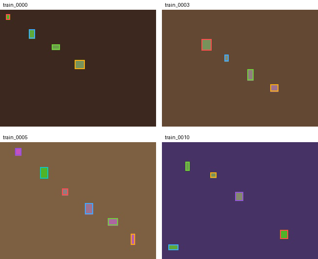
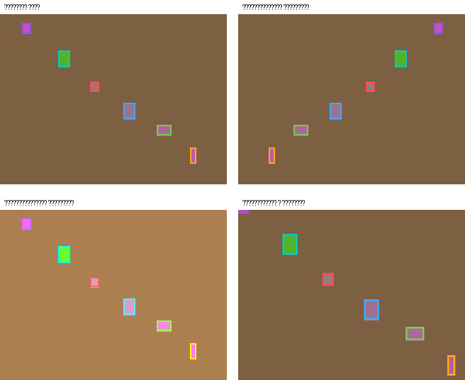

# Теоретические основы и анализ подходов к аугментации для детекции малых объектов

## Краткая характеристика задач компьютерного зрения

В задачах компьютерного зрения обычно выделяются классификация изображений, обнаружение объектов и сегментация. Классификация определяет принадлежность изображения к одному или нескольким классам, детекция дополняет классификацию локализацией объектов на изображении, а сегментация переходит к более детальному пространственному описанию сцены на уровне областей или пикселей. [12, 15, 16, 17]

Для текущей работы центральной является именно задача обнаружения объектов, поскольку программный конвейер проекта ориентирован на YOLO-совместимую разметку, анализ ограничивающих рамок, запуск детектора и последующую оценку результатов через COCO-совместимые метрики. Вместе с тем краткое рассмотрение сегментации полезно как смежная теоретическая рамка, поскольку часть современных приемов аугментации, в том числе copy-paste, активно развивалась в задачах сегментации и затем переносилась на детекцию. [1, 9, 12, 22] (источник: README.md; src/pipeline_mvp.py)

## Задача сегментации изображений

Семантическая сегментация представляет собой задачу разбиения изображения на области, где каждому пикселю или области сопоставляется метка класса. В отличие от классификации изображения в целом, данный подход требует не только определить наличие объекта, но и достаточно точно описать его пространственное расположение и границы, что делает задачу более трудоемкой как с точки зрения модели, так и с точки зрения подготовки разметки. [15, 17]

Для смежной постановки instance segmentation характерно раздельное представление отдельных экземпляров объектов, обычно с использованием масок. Именно наличие объектных масок делает возможным корректное извлечение экземпляров и их последующее копирование в другие изображения, поэтому многие идеи copy-paste аугментации были впервые подробно обоснованы именно в контексте instance segmentation. [9, 16]

Для темы данной работы сегментация не является центральной задачей, однако её краткое рассмотрение важно по двум причинам. Во-первых, она показывает более общий класс задач, где пространственная структура объекта критична для качества модели. Во-вторых, она объясняет происхождение части методов аугментации, которые затем адаптируются для детекции в более простом варианте, например через операции с ограничивающими рамками вместо полноценных масок. [9, 15, 16] (источник: docs/AUGMENTATION_POLICY.md)

Сопоставление основных задач компьютерного зрения приведено в таблице 2. [12, 15, 16, 17] (источник: README.md; src/pipeline_mvp.py)

Таблица 2 - Сопоставление задач компьютерного зрения. [12, 15, 16, 17] (источник: README.md; src/pipeline_mvp.py)

| Задача | Что определяется | Тип результата | Связь с текущей работой |
|---|---|---|---|
| Классификация | Класс изображения | Метка или набор меток | Используется как базовая постановка для сравнения |
| Детекция объектов | Класс и локализация объекта | Ограничивающие рамки | Является основной задачей проекта |
| Семантическая сегментация | Класс для каждой области или пикселя | Карта классов | Рассматривается как смежная постановка |
| Instance segmentation | Класс и маска каждого экземпляра | Набор масок объектов | Важна как источник идей для copy-paste |

Примеры плотных сцен с большим количеством малых объектов, характерных для UAV- и overhead-данных, показаны на рисунке 1. Для подобных изображений уже на этапе визуального анализа заметна высокая плотность целей, а также значительная неоднородность масштаба объектов, что и делает задачу чувствительной к выбору стратегии аугментации. [2, 4, 27, 29]

Рисунок 1 - Примеры кадров с малыми объектами из VisDrone-подобного набора данных. [2, 29]

## Аугментация данных и её основные виды

Аугментация данных представляет собой способ расширения обучающей выборки за счет преобразования уже имеющихся примеров. В современных работах по автоматическому подбору augmentation policy и в инженерных руководствах для детекции такой подход рассматривается как средство повышения устойчивости модели к вариативности данных, однако его применение требует контроля над тем, как трансформации влияют на геометрию сцены и согласованность разметки. [3, 5, 7, 21, 22, 23]

К базовым примерам аугментации изображений относятся повороты, отражения, изменение масштаба, добавление шума, изменение яркости и размытие. В практических библиотеках и фреймворках для детекции эти преобразования обычно дополняются сдвигами, перспективными преобразованиями, фотометрическими изменениями и смешивающими аугментациями, однако применимость каждого из этих приемов определяется тем, допускает ли задача изменение геометрии сцены и насколько устойчивой остается разметка ограничивающих рамок. [5, 7, 20, 21, 24]

Для современных детекторов важна не только сама идея увеличения числа обучающих примеров, но и совместимость преобразований с аннотациями объектов. В документации Albumentations отдельно подчеркивается, что аугментации для задач с bounding boxes должны согласованно изменять как изображение, так и координаты рамок, иначе обучение модели будет происходить на искаженной разметке. [7, 21]

В проекте используется сочетание встроенных параметров аугментации Ultralytics и пользовательских преобразований, подключаемых через Python API. Такая архитектура позволяет разделить простые скалярные параметры, представимые в YAML-конфигурации, и более сложные объектно-ориентированные операции, требующие отдельной программной реализации, например `BBoxAwareCrop` и `BBoxCopyPaste`. (источник: docs/AUGMENTATION_POLICY.md; README.md; src/pipeline_mvp.py)

Основные группы аугментаций, имеющих значение для задачи детекции малых объектов, приведены в таблице 3. [5, 7] (источник: docs/AUGMENTATION_POLICY.md)

Таблица 3 - Основные группы аугментаций для задач детекции. [5, 7] (источник: docs/AUGMENTATION_POLICY.md)

| Группа | Примеры | Потенциальная польза | Возможный риск для малых объектов |
|---|---|---|---|
| Геометрические | Поворот, сдвиг, масштабирование, crop | Повышение устойчивости к положению и масштабу | Потеря части объекта или уменьшение различимости |
| Фотометрические | Изменение яркости, насыщенности, контраста | Устойчивость к условиям освещения | Обычно риск ниже, чем у геометрических преобразований |
| Смешивающие | Mosaic, MixUp, CutMix | Рост разнообразия сцен и контекстов | Ослабление визуального сигнала малых объектов |
| Объектные | Copy-paste, object bank | Усиление представления редких и малых объектов | Неестественные сцены при плохом контроле перекрытий |

Примеры типовых преобразований, обсуждаемых в литературе и прикладной документации по аугментациям для детекции, приведены на рисунке 2. Даже такие простые визуальные примеры показывают, что одинаковая по названию операция может по-разному влиять на различимость малых объектов в зависимости от плотности сцены и исходного масштаба целей. [5, 7, 20, 21, 24]

Рисунок 2 - Примеры геометрических и фотометрических преобразований на кадре с малыми объектами. [5, 7, 20, 21]

## Особенности аугментации данных для малых объектов

Малые объекты характеризуются тем, что занимают ограниченное число пикселей на изображении, поэтому любая дополнительная деформация, ресайз или потеря части рамки влияет на них сильнее, чем на средние и крупные объекты. По этой причине в анализе small object detection важны не только общие метрики качества, но и специальные показатели, ориентированные на малые объекты, в частности `AP_small`, а в текущем проекте также используется расширение `AP_tiny` как дополнительная внутренняя метрика. [1, 8, 22, 24, 25, 26, 27] (источник: docs/DATASET_ANALYTICS.md; README.md)

В проектной аналитике малые и очень малые объекты описываются через COCO-подобные пороги площади в пикселях. Это позволяет переходить от качественного описания датасета к количественным признакам, которые затем используются в rule-based механизме выбора аугментаций. [1, 11, 18, 20, 26] (источник: docs/DATASET_ANALYTICS.md; docs/THRESHOLDS.md)

Доля малых объектов в выборке определяется по формуле. (источник: docs/DATASET_ANALYTICS.md)

$$
small\_ratio = \frac{num\_small\_objects}{num\_objects}
$$ (1)

где `num_small_objects` обозначает число объектов, попадающих в категорию `small`, а `num_objects` обозначает общее число объектов в рассматриваемом наборе данных. (источник: docs/DATASET_ANALYTICS.md)

Если значительная часть объектов относится к малым, агрессивные геометрические преобразования становятся потенциально опасными. В документации проекта прямо зафиксировано, что при `small_ratio >= 0.5` активируются ограничения на вращение, сдвиг, масштабирование и перспективные преобразования, поскольку чрезмерное изменение геометрии может вывести малые объекты за пределы полезного разрешения детектора. [4, 18, 24, 25, 26, 27] (источник: docs/AUGMENTATION_POLICY.md; docs/THRESHOLDS.md)

Для dense-сцен существенным фактором является не только размер объектов, но и их локальная концентрация. В проекте плотность описывается, в частности, через число объектов на мегапиксель, что позволяет учитывать различия между сценами одинаковой семантики, но разного разрешения. [3, 18, 19, 20, 26, 27] (источник: docs/DATASET_ANALYTICS.md)

Нормированная плотность сцены вычисляется по формуле. (источник: docs/DATASET_ANALYTICS.md)

$$
objects\_per\_mpix = \frac{object\_count}{(image\_width \cdot image\_height) / 10^6}
$$ (2)

где `object_count` обозначает число объектов на изображении, а `image_width` и `image_height` обозначают исходные размеры изображения в пикселях. (источник: docs/DATASET_ANALYTICS.md)

Для выборок с большим количеством малых и плотных объектов полезность аугментации определяется уже не только способностью повысить разнообразие данных, но и способностью сохранить видимость объектов после преобразования. Поэтому в проекте используются консервативные параметры `min_visibility`, `min_area`, ограничение на перекрытие при copy-paste и контроль числа вставляемых объектов, что делает пользовательские аугментации более безопасными для целевой постановки. [7, 9, 21, 23] (источник: docs/AUGMENTATION_POLICY.md; docs/THRESHOLDS.md)

Дополнительная специфика малых объектов связана с дисбалансом классов. Если редкие классы представлены преимущественно малыми экземплярами, то стандартные аугментации не обязательно увеличивают их реальную встречаемость в обучении. По этой причине в проекте предусмотрен выбор tail-классов по статистике малых объектов и последующее усиление их представления через bbox copy-paste и object bank. [9, 20, 23, 26, 27] (источник: docs/DATASET_ANALYTICS.md; docs/AUGMENTATION_POLICY.md; README.md)

## Существующие подходы к выбору аугментаций

Одним из базовых вариантов является ручной подбор параметров аугментации, когда исследователь заранее фиксирует набор допустимых преобразований и их интенсивность. Такой подход прост в реализации и хорошо контролируется, однако его переносимость между датасетами ограничена, поскольку один и тот же набор параметров может быть приемлемым для крупных объектов и одновременно вредным для сцен с преобладанием очень малых экземпляров. [5, 20, 21] (источник: docs/AUGMENTATION_POLICY.md)

Другой класс методов связан с автоматизированным поиском augmentation policy. В работе AutoAugment показано, что политика аугментации может быть найдена автоматически на основе качества модели, однако подобный подход требует заметных вычислительных затрат и ориентирован на поиск в пространстве преобразований, а не на прямую интерпретацию свойств конкретного датасета. Последующие методы RandAugment, TrivialAugment и Faster AutoAugment упрощают или ускоряют эту идею, но не снимают саму проблему вычислительной стоимости и ограниченной интерпретируемости найденной политики. [3, 21, 22, 23]

Развитием данной линии для детекции является scale-aware automatic augmentation, где политика строится с учетом масштаба объектов. Такие подходы важны для small object detection, поскольку показывают, что размер и распределение объектов должны рассматриваться как первичные признаки при выборе безопасных преобразований, а не как второстепенные детали настройки обучения. [4, 18, 26, 27]

В прикладных фреймворках для детекции распространён и более инженерный подход, при котором комбинируются стандартные параметры аугментации, встроенные в тренировочный пайплайн модели, и внешние библиотеки преобразований. Документация Ultralytics и Albumentations демонстрирует, что подобная комбинация удобна на практике, но требует строгого контроля совместимости преобразований с разметкой и осмысленного выбора диапазонов параметров. [5, 7]

Отдельную группу составляют объектно-ориентированные аугментации, например copy-paste. В работе `Simple Copy-Paste Is a Strong Data Augmentation Method for Instance Segmentation` показано, что копирование объектов между изображениями может быть сильным практическим приемом, однако корректность такого переноса зависит от качества выделения объекта и от правдоподобия его размещения в новой сцене. Для детекции без масок это означает необходимость дополнительных ограничений на перекрытие и выбор доноров. [9, 23] (источник: docs/AUGMENTATION_POLICY.md)

В задачах обнаружения малых объектов важным альтернативным направлением является tiling, то есть разбиение исходных изображений на более мелкие фрагменты. В работе `The Power of Tiling for Small Object Detection` и в более поздних работах по slicing-aided inference показано, что переход к фрагментам может повысить различимость малых объектов за счет увеличения их относительного масштаба в кадре, однако такая стратегия должна рассматриваться совместно с остальными этапами подготовки данных и не заменяет задачу выбора адекватной policy аугментации. [10, 25] (источник: src/data/tiling.py; src/pipeline_mvp.py)

## Обоснование выбранного подхода и место текущего проекта

С учетом рассмотренных подходов в текущей работе выбран интерпретируемый rule-based способ построения augmentation policy. В отличие от полностью ручной настройки он опирается на измеримые статистики датасета, а в отличие от поисковых AutoAug-like схем не требует дорогостоящего внешнего поиска по пространству политик. Такая постановка соответствует целям проекта, где важно не только получить рабочую конфигурацию, но и объяснить, почему она была выбрана. [3, 4] (источник: docs/AUGMENTATION_POLICY.md; README.md)

В текущем проекте эта логика реализована как последовательность этапов `dataset statistics -> flags -> fired rules -> policy parameters`. На практике конвейер выполняет проверку структуры датасета, анализирует характеристики разметки и изображений, формирует `policy_adaptive.json`, сохраняет `decision_report.json`, затем запускает обучение и оценку результатов в сопоставимых режимах. (источник: docs/AUGMENTATION_POLICY.md; docs/DATASET_ANALYTICS.md; src/pipeline_mvp.py)

Выбор такого подхода представляется обоснованным для темы выпускной квалификационной работы, поскольку он позволяет совместить теоретическую интерпретируемость, практическую воспроизводимость и направленность на улучшение качества детекции именно малых объектов. Дальнейшее изложение посвящено описанию структуры проекта, разработанного метода и экспериментальной проверке его применимости. (источник: README.md; diploma/docs/narrative.md; src/pipeline_mvp.py)

## Источники раздела

- `[1]` COCO: Common Objects in Context. Использован для опоры на COCO-категории малых объектов и логику метрик. URL: https://arxiv.org/abs/1405.0312
- `[2]` Vision Meets Drones: A Challenge. Использован для описания специфики UAV- и overhead-сцен с большим числом малых объектов. URL: https://arxiv.org/abs/1804.07437
- `[3]` AutoAugment: Learning Augmentation Policies from Data. Использован для описания поискового подхода к аугментациям. URL: https://arxiv.org/abs/1805.09501
- `[4]` Scale-Aware Automatic Augmentation for Object Detection. Использован для обоснования учета масштаба объектов при выборе политики. URL: https://arxiv.org/abs/2103.16119
- `[5]` Ultralytics YOLO Data Augmentation Guide. Использован для описания прикладных аугментаций в современных детекционных пайплайнах. URL: https://docs.ultralytics.com/guides/yolo-data-augmentation/
- `[7]` Albumentations Bounding Boxes Guide. Использован для описания согласованного преобразования изображений и bounding boxes. URL: https://albumentations.ai/docs/3-basic-usage/bounding-boxes-augmentations/
- `[8]` pycocotools COCOeval. Использован для связи теории с практикой оценки качества детекции. URL: https://github.com/cocodataset/cocoapi/blob/master/PythonAPI/pycocotools/cocoeval.py
- `[9]` Simple Copy-Paste Is a Strong Data Augmentation Method for Instance Segmentation. Использован для объяснения происхождения и ограничений copy-paste аугментации. URL: https://openaccess.thecvf.com/content/CVPR2021/papers/Ghiasi_Simple_Copy-Paste_Is_a_Strong_Data_Augmentation_Method_for_Instance_CVPR_2021_paper.pdf
- `[10]` The Power of Tiling for Small Object Detection. Использован для описания tiling как подхода к работе с малыми объектами. URL: https://openaccess.thecvf.com/content_CVPRW_2019/papers/UAVision/Unel_The_Power_of_Tiling_for_Small_Object_Detection_CVPRW_2019_paper.pdf
- `[12]` You Only Look Once: Unified, Real-Time Object Detection. Использован для описания общей постановки задачи детекции. URL: https://arxiv.org/abs/1506.02640
- `[15]` Fully Convolutional Networks for Semantic Segmentation. Использован для описания постановки семантической сегментации. URL: https://doi.org/10.1109/TPAMI.2016.2572683
- `[16]` Mask R-CNN. Использован для описания instance segmentation как смежной постановки. URL: https://arxiv.org/abs/1703.06870
- `[17]` Encoder-Decoder with Atrous Separable Convolution for Semantic Image Segmentation. Использован для описания современных сегментационных моделей. URL: https://arxiv.org/abs/1802.02611
- `[18]` DOTA: A Large-Scale Dataset for Object Detection in Aerial Images. Использован для описания аэроизображений и масштаба объектов в overhead-сценах. URL: https://doi.org/10.1109/CVPR.2018.00418
- `[20]` Object Detection in Optical Remote Sensing Images: A Survey and a New Benchmark. Использован для обзора датасетов и детекции в дистанционном зондировании. URL: https://doi.org/10.1016/j.isprsjprs.2019.11.023
- `[21]` RandAugment: Practical Automated Data Augmentation with a Reduced Search Space. Использован для описания упрощенных search-based стратегий аугментации. URL: https://arxiv.org/abs/1909.13719
- `[22]` TrivialAugment: Tuning-Free Yet State-of-the-Art Data Augmentation. Использован для описания tuning-free стратегий аугментации. URL: https://arxiv.org/abs/2103.10158
- `[23]` Faster AutoAugment: Learning Augmentation Strategies Using Backpropagation. Использован для описания ускоренных методов поиска augmentation policy. URL: https://arxiv.org/abs/1911.06987
- `[24]` YOLOv4: Optimal Speed and Accuracy of Object Detection. Использован для обсуждения mosaic и смешивающих аугментаций в детекции. URL: https://arxiv.org/abs/2004.10934
- `[25]` Slicing Aided Hyper Inference and Fine-tuning for Small Object Detection. Использован для описания slicing-подходов к малым объектам. URL: https://arxiv.org/abs/2202.06934
- `[26]` Small Object Detection Based on Deep Learning for Remote Sensing: A Comprehensive Review. Использован для обзора трудностей малых объектов в дистанционном зондировании. URL: https://www.mdpi.com/2072-4292/15/13/3265
- `[27]` A Survey of Small Object Detection Based on Deep Learning in Aerial Images. Использован для актуального обзора методов детекции малых объектов в аэроизображениях. URL: https://link.springer.com/article/10.1007/s10462-025-11150-9
- `[29]` VISDRONE. Использован как официальный источник сведений о датасете и challenge-сценариях. URL: https://aiskyeye.com/
- `README.md`. Использован для связи теоретического обзора с архитектурой и возможностями текущего проекта. (источник: README.md)
- `docs/DATASET_ANALYTICS.md`. Использован для определения статистик, порогов и формализованных признаков малых объектов. (источник: docs/DATASET_ANALYTICS.md)
- `docs/AUGMENTATION_POLICY.md`. Использован для описания выбранной rule-based стратегии, пользовательских аугментаций и их ограничений. (источник: docs/AUGMENTATION_POLICY.md)
- `docs/THRESHOLDS.md`. Использован для описания пороговых значений и безопасных диапазонов параметров. (источник: docs/THRESHOLDS.md)
- `src/pipeline_mvp.py`. Использован для связи обзорной части с реализованным конвейером проекта. (источник: src/pipeline_mvp.py)
- `src/data/tiling.py`. Использован для подтверждения поддержки tiling в текущем проекте. (источник: src/data/tiling.py)
- `diploma/docs/narrative.md`. Использован для согласования логики главы с общим сценарием ВКР. (источник: diploma/docs/narrative.md)
