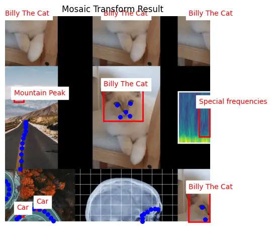
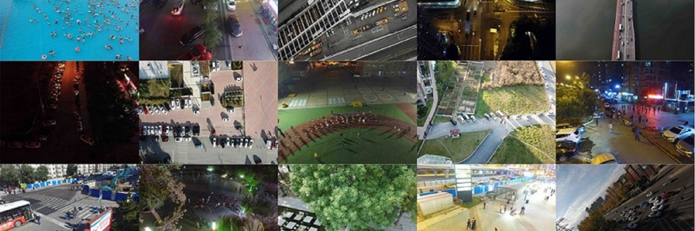

# Теоретические основы и анализ подходов к аугментации для детекции малых объектов

## Краткая характеристика задач компьютерного зрения

В научной литературе по компьютерному зрению обычно выделяются задачи классификации изображений, обнаружения объектов и сегментации изображений. Классификация отвечает на вопрос о принадлежности изображения к одному или нескольким классам, обнаружение объектов дополняет распознавание локализацией экземпляров в виде ограничивающих рамок, а сегментация переходит к описанию сцены на уровне областей или отдельных пикселей. [7]

Для задачи обнаружения объектов важны не только признаки класса, но и сохранение пространственной структуры сцены, поскольку модель должна одновременно определить наличие объекта и его положение на изображении. По этой причине подготовка данных в таких системах должна учитывать влияние преобразований как на само изображение, так и на координаты аннотаций. [8]

В обзорах по аэрофотоснимкам и дистанционному зондированию Земли подчеркивается, что дополнительную сложность внутри задачи обнаружения составляет работа с малыми объектами. Небольшая площадь цели, высокая плотность сцены, частичные перекрытия и сильная изменчивость масштаба заметно повышают чувствительность модели к способу предварительной обработки данных. [6]

Сопоставление базовых задач компьютерного зрения приведено в таблице 1. [7]

Таблица 1 - Сопоставление базовых задач компьютерного зрения [7]

| Задача | Что определяется | Тип результата | Пространственная детализация |
|---|---|---|---|
| Классификация | Класс изображения или сцены | Метка класса либо набор меток | Глобальная |
| Обнаружение объектов | Класс и положение экземпляра | Ограничивающая рамка | Объектная |
| Семантическая сегментация | Класс для каждой области или пикселя | Карта классов | Пиксельная |
| Экземплярная сегментация | Класс и маска отдельного экземпляра | Набор масок объектов | Пиксельная и объектная |

## Кратко о сегментации изображений

В русскоязычных публикациях сегментация изображения обычно определяется как разбиение изображения на однородные области или как сопоставление каждому пикселю метки класса. Такая постановка особенно важна в прикладных задачах медицинской визуализации, картографии и анализа спутниковых снимков, где требуется детальное пространственное описание сцены. [7]

В работе о полностью сверточных сетях Fully Convolutional Networks [9] показано, что переход к полностью сверточной архитектуре позволяет принимать изображения произвольного размера и формировать детализированную карту предсказаний без отдельного классификационного блока. Эта работа стала одной из основ современных методов семантической сегментации. [9]

В более поздних архитектурах, таких как DeepLabv3+ [10], дополнительное значение получают механизмы сохранения контекста и уточнения границ объектов. За счет пространственно-разреженных сверток и декодирующего блока такие модели улучшают детализацию результата и лучше работают со сложными границами сегментируемых областей. [10]

Экземплярная сегментация расширяет данную постановку, поскольку требует отделять друг от друга отдельные экземпляры одного и того же класса. В работе Mask R-CNN [11] эта задача формулируется как совместное предсказание класса, ограничивающей рамки и маски объекта, что особенно важно там, где прямоугольной локализации недостаточно. [11]

Для темы настоящей работы сегментация важна прежде всего как источник идей для объектно-ориентированных аугментаций. Именно из этой области в задачи обнаружения объектов пришли методы контролируемого переноса объектов между сценами, в частности семейство преобразований переноса объектов Copy-Paste. [12]

## Аугментация данных и ее основные виды

Под аугментацией данных в русскоязычных работах обычно понимается увеличение обучающей выборки путем модификации уже имеющихся примеров или генерации новых вариантов на их основе. Такая процедура используется как средство повышения обобщающей способности модели и как способ частично компенсировать ограниченность исходного набора данных. [4]

В современных системах обнаружения объектов наибольшее распространение получили геометрические, фотометрические и композиционные преобразования. К геометрическим обычно относят отражение, поворот, сдвиг и масштабирование, к фотометрическим - изменение яркости, контраста, насыщенности и размытости, а к композиционным - смешивание нескольких изображений или перенос объектов между сценами. [13]

Пример композиционной аугментации, в которой несколько изображений объединяются в одно и ограничивающие рамки переносятся в новую систему координат, приведен на рисунке 1. [13]

Рисунок 1 - Пример мозаичной аугментации по документации Ultralytics [13]

Принципиальное требование для задач обнаружения объектов состоит в том, что преобразование изображения должно сопровождаться согласованным преобразованием ограничивающих рамок. В документации Albumentations прямо отмечается, что использование операций без корректного обновления координат приводит к рассогласованию изображения и разметки и тем самым ухудшает обучающий сигнал для модели. [14]

Одной из основных величин, связывающих геометрию рамок с качеством локализации, является коэффициент пересечения по объединению (Intersection over Union, IoU). Для предсказанной рамки и эталонной рамки эта величина вычисляется как отношение площади их пересечения к площади их объединения. [15]

$$
IoU = \frac{|B_pred \cap B_gt|}{|B_pred \cup B_gt|}.
$$

В этом выражении `B_pred` обозначает предсказанную ограничивающую рамку, `B_gt` - эталонную ограничивающую рамку, а итоговое значение `IoU` тем выше, чем точнее совпадают их положения и размеры. Именно эта величина используется при расчете большинства COCO-совместимых показателей качества локализации. [15]

## Особенности аугментации данных для малых объектов

В материалах VisDrone и в современных обзорах по обнаружению малых объектов отмечается, что значительная часть целевых экземпляров в аэрофотоснимках имеет очень небольшую площадь, а сами сцены часто содержат множество близко расположенных объектов. В такой ситуации даже умеренное искажение геометрии способно привести к потере различимых признаков и к росту числа пропусков. [2]

В COCO-совместимой постановке категория малых объектов обычно соотносится с ограничивающими рамками площадью менее 32 × 32 пикселей на исходном изображении. Этот порог используется как общий ориентир при анализе методов, специально нацеленных на повышение качества обнаружения небольших целей. [1]

Площадь ограничивающей рамки вычисляется как произведение ее ширины на высоту в пикселях. Чем меньше эта площадь, тем сильнее объект зависит от выбора масштаба изображения, параметров кадрирования и точности последующего преобразования рамок. [3]

$$
S = W \cdot H.
$$

Здесь `S` обозначает площадь ограничивающей рамки, `W` - ее ширину, а `H` - высоту. При малом значении `S` объект особенно чувствителен к уменьшению масштаба, обрезке по краю кадра и повторной дискретизации изображения. [3]

Для малых объектов агрессивные геометрические преобразования особенно рискованны. В работе по масштабно-чувствительной автоматической аугментации для обнаружения объектов [5] показано, что выбор операций аугментации должен учитывать размеры объектов, а в исследованиях по тайловому разбиению изображения и инференсу с разбиением на фрагменты показано, что увеличение локального масштаба цели может заметно улучшать качество обнаружения. [5]

Существенную роль играет и контекст сцены. На аэрофотоснимках объекты нередко малы не только сами по себе, но и потому, что наблюдаются на большом фоне, включающем дорожную сеть, здания, парковки и другие структурные элементы. Поэтому преобразования, слишком сильно искажающие фон или плотность расположения объектов, могут влиять на качество обнаружения не меньше, чем прямое изменение размеров ограничивающих рамок. [6]

Этой спецификой объясняется интерес к таким методам, как перенос объектов между сценами, мозаичная аугментация, тайловое разбиение изображений и инференс по фрагментам. В работе, посвященной тайловому разбиению изображений для обнаружения малых объектов, показано, что разбиение крупных изображений на более мелкие фрагменты повышает относительный масштаб объектов и улучшает условия их обнаружения. [16]

В работе SAHI [17] эта идея развивается в сторону инференса и последующего объединения предсказаний по фрагментам изображения. Для крупных сцен с мелкими объектами такой подход позволяет улучшать чувствительность детектора без радикального изменения архитектуры модели. [17]

Примеры плотных сцен из VisDrone, содержащих большое число малых объектов, приведены на рисунке 2. [2]

Рисунок 2 - Примеры изображений VisDrone с плотным размещением малых объектов [2]

## Подходы к выбору аугментаций

Первый класс подходов основан на ручном подборе политики аугментации. В этом случае исследователь самостоятельно выбирает набор операций и диапазоны их параметров, опираясь на специфику предметной области и результаты предварительных экспериментов. [13]

Второй класс подходов связан с автоматическим поиском политики аугментации. В работе AutoAugment [18] предложен поиск последовательностей преобразований в заданном пространстве операций, а в Faster AutoAugment [21] эта идея была развита в сторону более эффективной процедуры подбора. [18]

Чтобы уменьшить вычислительные затраты поисковых методов, были предложены упрощенные подходы RandAugment [19] и TrivialAugment [20]. Они сокращают пространство гиперпараметров и упрощают практическое применение, но при этом не учитывают свойства конкретного датасета так явно, как специализированные методы для малых объектов. [19]

Отдельный интерес для данной работы представляют масштабно-чувствительные методы. В работе по масштабно-чувствительной автоматической аугментации для обнаружения объектов [5] показано, что при выборе операций аугментации полезно явно учитывать размеры объектов, а работы по тайловому разбиению изображений и по инференсу с разбиением на фрагменты подтверждают пользу локального увеличения масштаба объектов в крупных сценах. [5]

Сопоставление основных подходов к выбору аугментаций приведено в таблице 2. [18]

Таблица 2 - Сопоставление подходов к выбору аугментаций [18]

| Подход | Основная идея | Достоинства | Ограничения |
|---|---|---|---|
| Ручная настройка | Эксперт задает операции и диапазоны параметров | Простота интерпретации | Сильная зависимость от опыта и конкретного датасета |
| AutoAugment | Поиск политики в пространстве операций | Формализованный подбор преобразований | Высокая вычислительная стоимость |
| RandAugment | Упрощенный автоматический подбор | Небольшое число гиперпараметров | Нет явного учета структуры датасета |
| TrivialAugment | Настройка без подбора гиперпараметров | Простота внедрения | Ограниченная адаптация к предметной области |
| Масштабно-чувствительная аугментация | Выбор операций с учетом размеров объектов | Лучше согласуется с задачей малых объектов | Требует надежных статистик датасета |
| Тайловое разбиение и инференс по фрагментам | Повышение локального масштаба цели | Эффективно для крупных сцен | Усложняет подготовку данных и оценку |

## Выводы по теоретической главе

Проведенный обзор показывает, что задача аугментации в системах обнаружения малых объектов не сводится к механическому расширению обучающей выборки. Для таких данных принципиально важны масштаб цели, плотность сцены, корректность преобразования ограничивающих рамок и сохранение правдоподобного контекста после применения сложных операций. [6]

Следовательно, наибольший интерес для дальнейшего исследования представляют подходы, связывающие выбор преобразований с измеримыми свойствами конкретного датасета. Такая логика согласуется с результатами работ по масштабно-чувствительной аугментации, тайловому разбиению изображений и обработке фрагментов и служит теоретическим основанием для перехода к постановке прикладной задачи и описанию собственного программного решения. [5]

## Источники раздела

[1] COCO: Common Objects in Context. URL: https://arxiv.org/abs/1405.0312
[2] Vision Meets Drones: A Challenge. URL: https://arxiv.org/abs/1804.07437
[3] Обнаружение и классификация малоразмерных летающих объектов на изображениях с использованием сверточных нейронных сетей семейства YOLOv5. URL: https://cyberleninka.ru/article/n/obnaruzhenie-i-klassifikatsiya-malorazmernyh-letayuschih-obektov-na-izobrazheniyah-s-ispolzovaniem-svertochnyh-neyronnyh-setey
[4] Генерация биомедицинских изображений для аугментации данных с помощью генеративно-состязательных сетей. URL: https://cyberleninka.ru/article/n/generatsiya-biomeditsinskih-izobrazheniy-dlya-augmentatsii-dannyh-s-pomoschyu-generativno-sostyazatelnyh-setey
[5] Scale-Aware Automatic Augmentation for Object Detection. URL: https://arxiv.org/abs/2103.16119
[6] A Survey of Small Object Detection Based on Deep Learning in Aerial Images. URL: https://link.springer.com/article/10.1007/s10462-025-11150-9
[7] Обзор некоторых алгоритмов сегментации изображений. URL: https://cyberleninka.ru/article/n/obzor-nekotoryh-algoritmov-segmentatsii-izobrazheniy
[8] You Only Look Once: Unified, Real-Time Object Detection. URL: https://arxiv.org/abs/1506.02640
[9] Fully Convolutional Networks for Semantic Segmentation. URL: https://doi.org/10.1109/TPAMI.2016.2572683
[10] Encoder-Decoder with Atrous Separable Convolution for Semantic Image Segmentation. URL: https://arxiv.org/abs/1802.02611
[11] Mask R-CNN. URL: https://arxiv.org/abs/1703.06870
[12] Simple Copy-Paste Is a Strong Data Augmentation Method for Instance Segmentation. URL: https://openaccess.thecvf.com/content/CVPR2021/papers/Ghiasi_Simple_Copy-Paste_Is_a_Strong_Data_Augmentation_Method_for_Instance_CVPR_2021_paper.pdf
[13] Ultralytics YOLO Data Augmentation Guide. URL: https://docs.ultralytics.com/guides/yolo-data-augmentation/
[14] Albumentations Bounding Boxes Guide. URL: https://albumentations.ai/docs/3-basic-usage/bounding-boxes-augmentations/
[15] pycocotools COCOeval. URL: https://github.com/cocodataset/cocoapi/blob/master/PythonAPI/pycocotools/cocoeval.py
[16] The Power of Tiling for Small Object Detection. URL: https://openaccess.thecvf.com/content_CVPRW_2019/papers/UAVision/Unel_The_Power_of_Tiling_for_Small_Object_Detection_CVPRW_2019_paper.pdf
[17] Slicing Aided Hyper Inference and Fine-tuning for Small Object Detection. URL: https://arxiv.org/abs/2202.06934
[18] AutoAugment: Learning Augmentation Policies from Data. URL: https://arxiv.org/abs/1805.09501
[19] RandAugment: Practical Automated Data Augmentation with a Reduced Search Space. URL: https://arxiv.org/abs/1909.13719
[20] TrivialAugment: Tuning-Free Yet State-of-the-Art Data Augmentation. URL: https://arxiv.org/abs/2103.10158
[21] Faster AutoAugment: Learning Augmentation Strategies Using Backpropagation. URL: https://arxiv.org/abs/1911.06987
