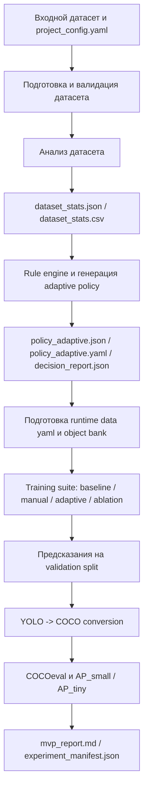

# Архитектура программного конвейера

В данной главе рассматривается архитектурная организация программного конвейера, обеспечивающего переход от исходного датасета к анализу, генерации adaptive policy, обучению модели и итоговой оценке результатов. Такое разбиение необходимо для того, чтобы последующее описание реализации опиралось на уже выделенные модули, их ответственность и типы создаваемых артефактов. (источник проекта: diploma/docs/narrative.md; README.md; src/pipeline_mvp.py)

## Общая схема конвейера

В верхнеуровневом представлении архитектура проекта строится как линейно-связанная последовательность этапов, где результаты каждого шага используются следующим модулем без ручного вмешательства в структуру данных. Конвейер начинается с подготовки и валидации датасета, затем переходит к расчету статистик, на их основе формирует adaptive policy, после чего может запускать suite обучения, выполнять оценку и сохранять итоговый экспериментальный манифест. (источник проекта: README.md; docs/DATASET_ANALYTICS.md; docs/AUGMENTATION_POLICY.md; src/pipeline_mvp.py)

С точки зрения архитектурной композиции ключевым элементом является единая функция `run_mvp_pipeline`, которая координирует вызовы модулей подготовки данных, анализа, генерации policy, обучения и оценки. Это решение упрощает воспроизводимость, поскольку делает `pipeline_mvp.py` основной точкой входа и фиксирует стандартную последовательность стадий вычислительного процесса, согласованную с YOLO-совместимым обучением и COCO-совместимой оценкой. [5, 8, 12] (источник проекта: src/pipeline_mvp.py; README.md)

Общая схема работы алгоритма приведена на рисунке 3. В ней отражены как основные вычислительные стадии, так и создаваемые на каждом этапе артефакты. [6, 8, 12] (источник проекта: src/pipeline_mvp.py; docs/DATASET_ANALYTICS.md; docs/AUGMENTATION_POLICY.md)

Рисунок 3 - Схема работы программного конвейера adaptive augmentations. [6, 8, 12] (источник проекта: src/pipeline_mvp.py; src/training/train_runner.py; src/evaluation/coco_converter.py; src/evaluation/metrics_report.py)

## Структура модулей

Архитектура проекта реализована в виде набора специализированных подмодулей внутри каталога `src/`. Такое разбиение позволяет локализовать ответственность за отдельные этапы конвейера и упрощает как расширение проекта, так и описание его устройства в тексте выпускной квалификационной работы. (источник проекта: README.md; src/pipeline_mvp.py)

Модуль `src/data` отвечает за подготовку и валидацию данных. В нем реализованы средства проверки структуры VisDrone-подобного YOLO-датасета, построения подвыборок, работы со сценарием COCO-small, чтения YOLO-разметки и, при необходимости, разбиения изображений на тайлы. Именно этот слой обеспечивает корректность входных данных для последующих этапов анализа и обучения. [6, 11, 12, 25, 29] (источник проекта: src/data/visdrone_manager.py; src/data/coco_small_manager.py; src/data/subset_builder.py; src/data/tiling.py; src/data/yolo_label_reader.py)

Модуль `src/analysis` реализует расчет статистик, необходимых для adaptive policy. Центральную роль здесь играет `dataset_analyzer.py`, который вычисляет дескрипторы площади ограничивающих рамок, плотности объектов, дисбаланса классов, размеров изображений и характеристик освещенности, а затем сохраняет результаты в JSON- и CSV-форматах. (источник проекта: src/analysis/dataset_analyzer.py; docs/DATASET_ANALYTICS.md)

Модуль `src/policy` отвечает за преобразование статистик в интерпретируемую политику аугментации. В `rule_engine.py` реализованы извлечение признаков, вычисление флагов, применение правил и формирование `decision_report.json`, тогда как `policy_schema.py` обеспечивает проверку структуры policy и фильтрацию параметров, совместимых с детекционным пайплайном Ultralytics. (источник проекта: src/policy/rule_engine.py; src/policy/policy_schema.py; docs/AUGMENTATION_POLICY.md)

Модуль `src/augmentation` содержит уровень пользовательских аугментаций и преобразования policy в формат, пригодный для запуска обучения. Здесь располагаются реализации `BBoxAwareCrop`, `BBoxCopyPaste`, логика object bank и механизм адаптации policy к Python API Ultralytics, что особенно важно для тех преобразований, которые не могут быть полностью выражены только в YAML-конфигурации. Такой слой проектной архитектуры напрямую соотносится с практиками Albumentations для работы с bounding boxes и с copy-paste подходами, пришедшими из современной литературы по augmentation для detection и segmentation. [5, 7, 9] (источник проекта: src/augmentation/albumentations_transforms.py; src/augmentation/object_bank.py; src/augmentation/policy_to_ultralytics.py; docs/AUGMENTATION_POLICY.md)

Модуль `src/training` инкапсулирует логику запуска режимов обучения. В `train_runner.py` формируется общий набор параметров, создаются конфигурации для `baseline`, `manual` и `adaptive` запусков, выполняются абляционные эксперименты и при необходимости организуется многоразовый запуск по нескольким seeds. Тем самым этот слой связывает adaptive policy с фактическим процессом обучения YOLO-модели и с инженерной практикой использования стандартных и кастомных augmentation-аргументов в Ultralytics-подобном контуре. [5, 12] (источник проекта: src/training/train_runner.py; README.md)

Модуль `src/evaluation` предназначен для перевода результатов обучения в сопоставимую систему метрик. Здесь реализованы преобразование YOLO-аннотаций и предсказаний в COCO-формат, запуск COCOeval, генерация итогового markdown-отчета по метрикам и подготовка материалов для включения в экспериментальный отчет. [1, 8, 11, 12] (источник проекта: src/evaluation/coco_converter.py; src/evaluation/coco_eval_runner.py; src/evaluation/metrics_report.py; src/evaluation/predict_runner.py)

Наконец, модуль `src/experiments` играет роль экспериментальной обвязки. В нем размещены средства генерации budget-aware AutoAug-like кандидатов и сводного анализа результатов, что позволяет рассматривать текущий rule-based подход не изолированно, а в контексте сопоставления с более затратными search-based стратегиями выбора политики аугментации. [3, 21, 23] (источник проекта: src/experiments/autoaug_search.py; src/experiments/summary.py; README.md)

## Потоки данных и артефакты

Архитектура конвейера опирается не только на набор модулей, но и на явный поток артефактов между ними. После завершения валидации и анализа формируются `validation_report.json`, `dataset_stats.json` и `dataset_stats.csv`, которые становятся входом для rule engine и одновременно служат диагностической базой для интерпретации особенностей датасета. Такая декомпозиция согласуется с идеей интерпретируемой COCO-совместимой оценки, где вычисленные статистики и итоговые метрики должны быть связаны явным и воспроизводимым образом. [1, 8, 11] (источник проекта: src/analysis/dataset_analyzer.py; src/data/visdrone_manager.py; docs/DATASET_ANALYTICS.md)

Результатом работы policy-уровня являются `policy_adaptive.json`, `policy_adaptive.yaml` и `decision_report.json`. Первый файл содержит полное описание adaptive policy, второй выступает как Ultralytics-совместимое представление scalar-параметров, а третий сохраняет объяснение сработавших правил и изменений параметров, что делает данный слой архитектуры интерпретируемым. (источник проекта: src/policy/rule_engine.py; docs/AUGMENTATION_POLICY.md)

Если активирован training suite, в архитектуре возникает дополнительный поток промежуточных данных. На этом этапе могут формироваться `runtime_data_yaml`, объектный банк для copy-paste, каталоги запусков для различных режимов обучения и, после выполнения инференса на validation split, каталоги предсказаний в формате YOLO. Для dense small-object сценариев сюда же при необходимости может подключаться этап slicing/tiling, известный по SAHI и работам по tiled detection. [10, 25] (источник проекта: src/pipeline_mvp.py; src/augmentation/object_bank.py; src/training/train_runner.py)

Финальный поток артефактов относится к этапу оценки. Здесь создаются COCO-совместимые файлы разметки и предсказаний, сохраняются результаты COCOeval, строится markdown-отчет по метрикам и записывается `experiment_manifest.json`, связывающий воедино пути к артефактам и значения временных затрат по стадиям конвейера. (источник проекта: src/evaluation/coco_converter.py; src/evaluation/coco_eval_runner.py; src/evaluation/metrics_report.py; src/pipeline_mvp.py)

## Расширяемость решения

Одним из требований к архитектуре проекта является ее расширяемость. Существующее разбиение на модули позволяет подключать новые датасеты, добавлять дополнительные статистические признаки, расширять набор правил adaptive policy и развивать сценарии сравнения без необходимости полной переработки конвейера. (источник проекта: README.md; src/pipeline_mvp.py; src/experiments/autoaug_search.py)

Первая очевидная точка расширения связана с поддержкой новых источников данных. Уже в текущем состоянии архитектура предусматривает несколько режимов работы с датасетами, включая VisDrone, COCO-small и обобщенный сценарий `yolo_generic`, а также допускает использование tiling как дополнительного этапа предварительной подготовки изображений для dense overhead-сцен. (источник проекта: src/pipeline_mvp.py; src/data/coco_small_manager.py; src/data/visdrone_manager.py; src/data/tiling.py)

Вторая точка расширения относится к уровню аналитики и rule engine. Поскольку архитектура явно отделяет вычисление статистик от принятия решений, проект может быть развит за счет добавления новых признаков, например более детализированных оценок локальной плотности, train-val shift, качества разметки или пространственного распределения объектов по сцене. (источник проекта: docs/DATASET_ANALYTICS.md; docs/THRESHOLDS.md; src/analysis/dataset_analyzer.py; src/policy/rule_engine.py)

Третья точка расширения связана с экспериментальной подсистемой. Наличие отдельного модуля для budget-aware AutoAug-like search и сводного анализа результатов позволяет постепенно развивать проект от MVP-конвейера к более широкому исследовательскому стенду, где интерпретируемый rule-based подход сравнивается с search-based альтернативами в сопоставимых условиях. (источник проекта: src/experiments/autoaug_search.py; README.md; diploma/docs/narrative.md)

## Источники раздела

- `[1]` COCO: Common Objects in Context. Использован для описания COCO-совместимой постановки оценки детекции. URL: https://arxiv.org/abs/1405.0312
- `[3]` AutoAugment: Learning Augmentation Policies from Data. Использован для описания search-based подходов к выбору policy. URL: https://arxiv.org/abs/1805.09501
- `[5]` Ultralytics YOLO Data Augmentation Guide. Использован для описания практики интеграции аугментаций в Ultralytics-подобный обучающий контур. URL: https://docs.ultralytics.com/guides/yolo-data-augmentation/
- `[6]` Ultralytics VisDrone Dataset Guide. Использован для описания прикладного контекста VisDrone. URL: https://docs.ultralytics.com/datasets/detect/visdrone/
- `[7]` Albumentations Bounding Boxes Guide. Использован для описания работы с bounding boxes в пользовательских аугментациях. URL: https://albumentations.ai/docs/3-basic-usage/bounding-boxes-augmentations/
- `[9]` Simple Copy-Paste Is a Strong Data Augmentation Method for Instance Segmentation. Использован для описания copy-paste как архитектурного мотива кастомных аугментаций. URL: https://openaccess.thecvf.com/content/CVPR2021/papers/Ghiasi_Simple_Copy-Paste_Is_a_Strong_Data_Augmentation_Method_for_Instance_CVPR_2021_paper.pdf
- `[8]` pycocotools COCOeval. Использован для описания метрик оценки и роли COCOeval. URL: https://github.com/cocodataset/cocoapi/blob/master/PythonAPI/pycocotools/cocoeval.py
- `[11]` COCO - Common Objects in Context. Использован как официальный источник сведений о датасете COCO. URL: https://cocodataset.org/index.htm
- `[12]` You Only Look Once: Unified, Real-Time Object Detection. Использован для описания YOLO-совместимого контура детекции. URL: https://arxiv.org/abs/1506.02640
- `[21]` RandAugment: Practical Automated Data Augmentation with a Reduced Search Space. Использован для описания упрощенных search-based стратегий. URL: https://arxiv.org/abs/1909.13719
- `[23]` Faster AutoAugment: Learning Augmentation Strategies Using Backpropagation. Использован для описания ускоренных методов поиска augmentation policy. URL: https://arxiv.org/abs/1911.06987
- `[25]` Slicing Aided Hyper Inference and Fine-tuning for Small Object Detection. Использован для описания slicing- и tiling-подходов. URL: https://arxiv.org/abs/2202.06934
- `[29]` VISDRONE. Использован как официальный источник сведений о датасете и challenge-сценарии. URL: https://aiskyeye.com/
