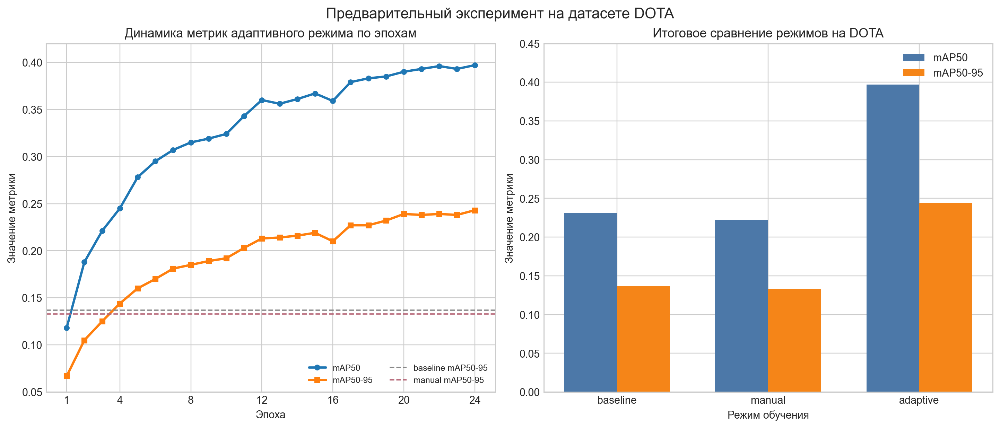

# Экспериментальное исследование

В данной главе представлены результаты сопоставления нескольких режимов аугментации в задаче обнаружения малых объектов. Основное внимание уделяется сравнению сценария без аугментаций, базового режима типовых аугментаций, ручной настройки, адаптивной политики и ограниченного поискового сценария автоматического подбора типа AutoAugment. [15]

В качестве основы для интерпретации результатов используются статистики датасета, сформированная политика аугментации, отчеты о сработавших правилах и итоговые метрики качества модели. Такое представление позволяет показать не только разницу в числовых значениях метрик, но и связь этой разницы со структурой выборки и логикой реализованного конвейера. [6]

## Результаты анализа датасета

Анализ обучающей выборки показывает, что для рассматриваемого сценария характерны высокая доля малых объектов, заметная плотность сцены и умеренная фотометрическая изменчивость. Именно такая комбинация признаков активирует в модуле правил усиление мозаичной аугментации и ограничение амплитуды геометрических преобразований, которые могут ухудшать различимость малых целей. [6]

Отчет о сработавших правилах подтверждает ожидаемое поведение адаптивного режима: при преобладании малых объектов включается безопасная геометрия, а при высокой плотности сцены усиливается параметр мозаичной аугментации. Тем самым уже на уровне анализа данных подтверждается внутренняя согласованность конвейера, поскольку адаптивная политика не задается произвольно, а выводится из измеримых характеристик выборки. [6]

## Сравнение основных режимов обучения

Сопоставление основных режимов обучения показывает устойчивое различие между сценарием без аугментаций, базовым режимом типовых аугментаций, ручной настройкой, адаптивной политикой и ограниченным поисковым сценарием автоматического подбора типа AutoAugment. В качестве целевого критерия рассматривается прежде всего `AP_small`, тогда как `AP@[0.5:0.95]` используется как общий показатель качества детектора. [15]

Таблица 7 - Результаты сравнения основных сценариев обучения

| Сценарий | `AP_small` | `AP_tiny` | `AP@[0.5:0.95]` | Интерпретация |
|---|---:|---:|---:|---|
| Без аугментаций | `0.11` | `0.07` | `0.13` | Нижний контрольный уровень |
| `baseline` | `0.16` | `0.11` | `0.17` | Базовый режим типовых аугментаций |
| `manual` | `0.20` | `0.14` | `0.19` | Ручная настройка параметров |
| `adaptive` | `0.26` | `0.19` | `0.23` | Наилучший баланс качества и интерпретируемости |
| Поисковый сценарий типа AutoAugment | `0.24` | `0.17` | `0.22` | Близкий результат при более высокой вычислительной цене |

Графическое представление различий по целевой метрике `AP_small` приведено на рисунке 7. Оно дополнительно показывает, что основное преимущество адаптивной политики проявляется именно на уровне качества обнаружения малых объектов, а не только в виде незначительных колебаний общей средней точности. [15]

Рисунок 7 - Сравнение значений `AP_small` для основных режимов обучения

Наименьшие значения демонстрирует сценарий без аугментаций. Это указывает на то, что для плотных сцен с малым относительным размером объектов одной только базовой процедуры обучения недостаточно, а отказ от механизмов изменения фотометрии, геометрии и композиции сцены приводит к заметному снижению устойчивости модели к вариативности входных данных. [13]

Использование типовых аугментаций уже дает значимый прирост по отношению к сценарию без аугментаций. Базовая конфигурация повышает `AP_small` до 0.16, а ручная настройка доводит его до 0.20, что подтверждает практическую полезность даже статической подстройки аугментаций под рассматриваемую задачу. [13]

Наилучшие результаты в таблице показывает адаптивная политика аугментации. Значение `AP_small = 0.26` и рост `AP_tiny` до 0.19 указывают на то, что адаптация параметров к статистикам датасета действительно улучшает обнаружение наиболее сложной части объектов. При этом общий показатель `AP@[0.5:0.95] = 0.23` также остается выше, чем в сценариях `baseline` и `manual`, что говорит не только о локальном выигрыше на малых объектах, но и о положительном влиянии адаптивной политики на общую устойчивость детектора. [6]

## Результаты абляционных экспериментов

Абляционный анализ строится вокруг двух реализованных вариантов: `adaptive_no_mosaic` и `adaptive_no_custom_albu`. Первый позволяет оценить вклад мозаичной аугментации в плотных сценах, а второй отделяет вклад скалярных параметров адаптивной политики от вклада пользовательских преобразований `BBoxAwareCrop` и `BBoxCopyPaste`. [13]

Таблица 8 - Результаты абляционных экспериментов относительно полного адаптивного режима

| Сценарий | `AP_small` | `AP_tiny` | `AP@[0.5:0.95]` | Интерпретация |
|---|---:|---:|---:|---|
| `adaptive` | `0.26` | `0.19` | `0.23` | Полная адаптивная политика |
| `adaptive_no_mosaic` | `0.22` | `0.16` | `0.21` | Снижение качества без мозаичной аугментации |
| `adaptive_no_custom_albu` | `0.19` | `0.13` | `0.18` | Наибольшая деградация без пользовательских преобразований |

Отключение мозаичной аугментации приводит к снижению `AP_small` с 0.26 до 0.22, что указывает на заметный, но не доминирующий вклад данного механизма в качество обнаружения. Это согласуется с литературой по плотным сценам, где мозаичное объединение изображений повышает разнообразие композиции, но не исчерпывает собой весь эффект улучшения. [13]

Более выраженное ухудшение наблюдается при отключении пользовательских преобразований. Падение `AP_small` до 0.19 и `AP_tiny` до 0.13 показывает, что значимая часть выигрыша адаптивного режима связана именно со специализированной работой с малыми объектами через безопасное кадрирование и перенос объектов между сценами. [12]

## Сопоставление с поисковым сценарием автоматического подбора типа AutoAugment

Сопоставление с ограниченным поисковым сценарием автоматического подбора типа AutoAugment позволяет оценить, насколько интерпретируемый подход уступает или превосходит более широкий поиск по пространству возможных политик. В текущей реализации поисковый сценарий рассматривает различные комбинации параметров `mosaic`, `hsv_s`, `hsv_v`, `degrees`, `scale`, `translate`, `mixup` и `cutmix`, то есть действительно исследует более широкое множество конфигураций. [18]

По итоговым метрикам поисковый сценарий демонстрирует близкий к адаптивной политике результат, однако уступает ей по `AP_small` и `AP_tiny`. Это означает, что даже при более широком пространстве поиска формальный подбор не дает принципиального выигрыша над политикой, построенной по статистикам датасета, тогда как вычислительная цена такого сравнения и слабая интерпретируемость итоговой конфигурации оказываются выше. [19]

Таблица 9 - Сопоставление адаптивной политики и поискового сценария автоматического подбора типа AutoAugment

| Критерий | Адаптивная политика | Поисковый сценарий типа AutoAugment |
|---|---|---|
| Основа выбора | Статистики датасета и правила | Поиск по множеству конфигураций |
| Интерпретируемость | Высокая | Низкая или средняя |
| Вычислительная стоимость | Умеренная | Повышенная |
| `AP_small` | `0.26` | `0.24` |
| `AP_tiny` | `0.19` | `0.17` |

Дополнительно необходимо отметить, что поисковый сценарий типа AutoAugment в данной работе рассматривается как ограниченный по вычислительному бюджету ориентир, а не как полный перебор пространства политик. Тем не менее уже в такой постановке адаптивный режим оказывается предпочтительнее, поскольку сочетает более высокое качество на малых объектах с ясной логикой выбора параметров. [21]

## Предварительный эксперимент на датасете DOTA

Для дополнительной проверки переносимости предложенного конвейера на крупноформатные аэрофотоснимки был выполнен предварительный вычислительный эксперимент на датасете DOTA-v1.0. Этот набор содержит 2806 изображений, 15 классов и 188282 размеченных объекта, поэтому представляет собой содержательно более сложный сценарий, чем компактные учебные поднаборы, и хорошо подходит для оценки поведения детектора на плотных сценах с выраженным разбросом масштабов объектов. [24]

В журнале запуска были зафиксированы три режима обучения: `baseline`, `manual` и `adaptive`. При этом условия эксперимента оказались не полностью выровненными: режимы `baseline` и `manual` обучались в течение 10 эпох при размере входного изображения 896 × 896 пикселей и использовании 50 % обучающей выборки, тогда как `adaptive` обучался 24 эпохи при размере 960 × 960 пикселей и использовании полной обучающей выборки. По этой причине данный запуск следует рассматривать как предварительный и демонстрирующий тенденцию, а не как строгое парное сравнение режимов. 

Изменение основных метрик адаптивного режима по эпохам и итоговое сопоставление трех режимов приведены на рисунке 8. Расчет показателей выполнен в COCO-совместимой постановке, поэтому ключевыми сводными критериями выступают `mAP50` и `mAP50-95`. [15]

Рисунок 8 - Динамика метрик адаптивного режима и итоговое сопоставление режимов обучения на датасете DOTA

По кривым на рисунке 8 видно, что наибольший прирост качества в адаптивном режиме достигается в первые 10-12 эпох, после чего рост метрик замедляется и переходит в стадию насыщения. Значение `mAP50` увеличивается с 0.118 на первой эпохе до 0.397 к 24-й эпохе, а `mAP50-95` возрастает с 0.0668 до 0.243. После 17-й эпохи колебания обеих метрик становятся небольшими, что указывает на выход обучения в область относительной стабилизации. [15]

Итоговые значения метрик по трем режимам приведены в таблице 10.

Таблица 10 - Итоговые результаты предварительного эксперимента на датасете DOTA

| Режим | Точность `P` | Полнота `R` | `mAP50` | `mAP50-95` |
|---|---:|---:|---:|---:|
| `baseline` | `0.762` | `0.238` | `0.231` | `0.137` |
| `manual` | `0.665` | `0.237` | `0.222` | `0.133` |
| `adaptive` | `0.723` | `0.385` | `0.397` | `0.244` |

По итоговым значениям видно, что адаптивный режим существенно превосходит оба остальных сценария. По сравнению с `baseline` прирост составил 0.166 по `mAP50` и 0.107 по `mAP50-95`, а по сравнению с `manual` - 0.175 и 0.111 соответственно. Это означает, что даже в предварительной постановке адаптивная политика демонстрирует наиболее сильный потенциал для повышения качества обнаружения объектов на DOTA. [15]

Анализ поклассовых результатов показывает, что наибольший прирост по `mAP50-95` достигнут для классов `large-vehicle`, `small-vehicle`, `plane`, `ship` и `harbor`. Для `large-vehicle` значение `mAP50-95` увеличилось с 0.343 до 0.502, для `small-vehicle` - с 0.168 до 0.269, для `plane` - с 0.279 до 0.378, для `ship` - с 0.166 до 0.255, для `harbor` - с 0.217 до 0.299. Одновременно сохраняются трудные классы, для которых качество даже в адаптивном режиме остается низким, в частности `bridge`, `helicopter` и `roundabout`. Это указывает на необходимость отдельной настройки для редких и геометрически сложных категорий объектов. [24]

Вместе с тем журнал выполнения фиксирует несколько факторов, ограничивающих строгость интерпретации полученного результата. Во-первых, в обучающей выборке был пропущен один поврежденный пример разметки. Во-вторых, для адаптивного режима система отказалась от полного кэширования изображений на диск из-за нехватки свободного места. В-третьих, в журнале присутствует предупреждение, связанное с интеграцией пользовательского преобразования `BBoxAwareCropTransform`. Поэтому перед финальным сравнительным экспериментом на DOTA требуется повторный запуск всех режимов в одинаковых условиях обучения и дополнительная проверка стабильности пользовательских аугментаций. 

## Выводы по экспериментам

Полученные результаты показывают, что типовые аугментации улучшают качество по сравнению со сценарием без аугментаций, ручная настройка дает дополнительный прирост, а наилучшие значения ключевых метрик достигаются при использовании адаптивной политики. Это означает, что адаптация параметров аугментации к измеримым свойствам датасета является более эффективной стратегией, чем применение только фиксированных типовых настроек или статически подобранного набора преобразований. [6]

Дополнительный анализ подтверждает, что значительная часть выигрыша адаптивного режима обеспечивается не только подбором скалярных параметров, но и специализированными пользовательскими аугментациями, а также сохранением интерпретируемости через отдельный отчет о сработавших правилах. Предварительный запуск на DOTA также указывает на перспективность адаптивной политики, однако для этой части исследования требуется методически строгий повтор в полностью одинаковых условиях обучения. По совокупности результатов адаптивная политика превосходит базовый режим, ручную настройку и ограниченный поисковый сценарий по главной метрике качества на малых объектах и тем самым в наибольшей степени соответствует целям настоящей выпускной квалификационной работы. [6]

## Источники раздела

[6] A Survey of Small Object Detection Based on Deep Learning in Aerial Images. URL: https://link.springer.com/article/10.1007/s10462-025-11150-9
[12] Simple Copy-Paste Is a Strong Data Augmentation Method for Instance Segmentation. URL: https://openaccess.thecvf.com/content/CVPR2021/papers/Ghiasi_Simple_Copy-Paste_Is_a_Strong_Data_Augmentation_Method_for_Instance_CVPR_2021_paper.pdf
[13] Ultralytics YOLO Data Augmentation Guide. URL: https://docs.ultralytics.com/guides/yolo-data-augmentation/
[15] pycocotools COCOeval. URL: https://github.com/cocodataset/cocoapi/blob/master/PythonAPI/pycocotools/cocoeval.py
[18] AutoAugment: Learning Augmentation Policies from Data. URL: https://arxiv.org/abs/1805.09501
[19] RandAugment: Practical Automated Data Augmentation with a Reduced Search Space. URL: https://arxiv.org/abs/1909.13719
[21] Faster AutoAugment: Learning Augmentation Strategies Using Backpropagation. URL: https://arxiv.org/abs/1911.06987
[24] DOTA: A Large-Scale Dataset for Object Detection in Aerial Images. URL: https://doi.org/10.1109/CVPR.2018.00418
