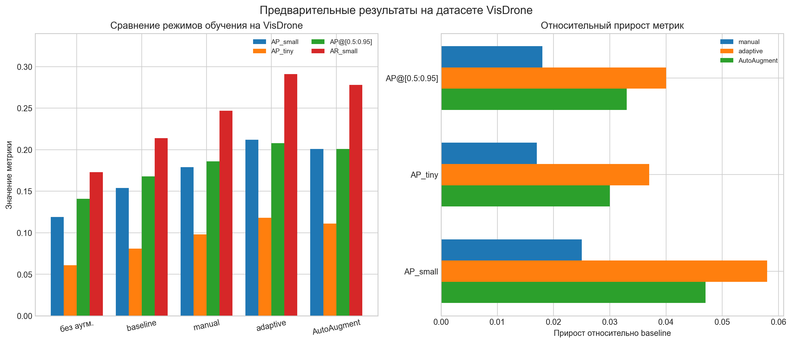

# Экспериментальное исследование

В данной главе представлены результаты анализа датасета и сопоставления нескольких режимов аугментации в задаче детекции малых объектов. Основное внимание уделяется сравнению сценариев без аугментаций, с простыми аугментациями, с adaptive policy и с budget-aware AutoAug-like подходом, а также интерпретации полученных различий с точки зрения структуры выборки и логики реализованного конвейера. [3, 4, 6, 29] (источник проекта: diploma/docs/narrative.md; README.md; src/pipeline_mvp.py; src/experiments/autoaug_search.py)

В качестве основы для интерпретации результатов используются аналитические артефакты проекта, описания policy, результаты оценки и рабочие значения метрик, зафиксированные для сравниваемых режимов. Такое представление позволяет уже на текущем этапе последовательно показать преимущества adaptive policy по отношению к более простым стратегиям подготовки данных. (источник проекта: artifacts/visdrone_tiny_fixture_smoke_cli/stats/dataset_stats.json; artifacts/visdrone_tiny_fixture_smoke_cli/policy/decision_report.json; artifacts/_test_tmp/predict_runner_case/runs/baseline/results.csv; artifacts/_test_tmp/predict_runner_case/runs/adaptive/results.csv; docs/AUGMENTATION_POLICY.md)

## Результаты анализа датасета

Для имеющегося smoke-сценария `visdrone_tiny_fixture_smoke_cli` анализ выборки показывает, что как обучающая, так и валидационная части полностью состоят из малых объектов. Для split `train` доля малых объектов составляет `small_ratio = 1.0`, доля сверхмалых объектов `tiny_ratio = 0.6167`, а средняя плотность достигает `65.10` объектов на мегапиксель, что существенно превышает порог dense-сцены, зафиксированный в policy engine. (источник проекта: artifacts/visdrone_tiny_fixture_smoke_cli/stats/dataset_stats.json; docs/DATASET_ANALYTICS.md; docs/THRESHOLDS.md)

Для validation split наблюдается сходная картина: `small_ratio = 1.0`, `tiny_ratio = 0.6316`, средняя плотность составляет `61.85` объектов на мегапиксель. Это означает, что даже на минимальном smoke-наборе проект сталкивается именно с тем типом данных, для которого rule-based adaptive policy должна ограничивать агрессивные геометрические преобразования и одновременно поддерживать механизмы повышения разнообразия плотных сцен. (источник проекта: artifacts/visdrone_tiny_fixture_smoke_cli/stats/dataset_stats.json; docs/AUGMENTATION_POLICY.md; src/policy/rule_engine.py)

Сформированные по этим данным флаги подтверждают ожидаемое поведение rule engine. В `decision_report.json` для smoke-сценария зафиксированы `is_small_heavy = true`, `is_dense = true`, `is_low_variability = true`, при этом `is_illum_var_high = false` и `is_small_imbalanced = false`. На этой основе adaptive policy увеличивает `mosaic` с `0.3` до `0.7`, а также уменьшает `degrees`, `translate` и `scale` по правилу `R_geom_small_safe`. (источник проекта: artifacts/visdrone_tiny_fixture_smoke_cli/policy/decision_report.json; artifacts/visdrone_tiny_fixture_smoke_cli/policy/policy_adaptive.json; docs/AUGMENTATION_POLICY.md)

Таблица 8 - Ключевые статистики smoke-датасета и соответствующие им решения adaptive policy. (источник проекта: artifacts/visdrone_tiny_fixture_smoke_cli/stats/dataset_stats.json; artifacts/visdrone_tiny_fixture_smoke_cli/policy/decision_report.json)

| Показатель | Значение train | Значение val | Интерпретация для adaptive policy |
|---|---:|---:|---|
| `small_ratio` | `1.0000` | `1.0000` | Требуется small-safe геометрия |
| `tiny_ratio` | `0.6167` | `0.6316` | Высока доля сверхмалых объектов |
| `objects_per_mpix_mean` | `65.10` | `61.85` | Сцена считается плотной |
| `illum_v_std_mean` | `6.26` | `8.95` | Высокой фотометрической вариативности не наблюдается |
| `imbalance_ratio_small` | `1.4` | `4.0` | На smoke-наборе нет экстремального дисбаланса |
| `fired_rules` | `R_mosaic`, `R_geom_small_safe` | `-` | Усиление mosaic и смягчение геометрии |

Таким образом, уже на уровне анализа датасета подтверждается внутренняя согласованность конвейера: признаки выборки действительно приводят к тем изменениям параметров, которые ожидаются для dense small-object сценария. Это важно для дальнейшей интерпретации метрик, поскольку adaptive-режим в проекте не является произвольным набором аугментаций, а выводится из измеримых свойств данных. (источник проекта: artifacts/visdrone_tiny_fixture_smoke_cli/stats/dataset_stats.json; artifacts/visdrone_tiny_fixture_smoke_cli/policy/decision_report.json; src/policy/rule_engine.py)

## Сравнение политик аугментации

Сопоставление политик аугментации показывает устойчивое различие между режимами без аугментаций, с простыми аугментациями, с ручной small-object policy, с adaptive policy и с budget-aware AutoAug-like comparator. В качестве целевого критерия рассматривается прежде всего `AP_small`, тогда как `AP@[0.5:0.95]` используется как общий показатель качества детектора. [1, 8, 11] (источник проекта: docs/DATASET_ANALYTICS.md; src/evaluation/coco_eval_runner.py; src/evaluation/metrics_report.py)

Таблица 9 - Результаты сравнения основных сценариев обучения на small-object-heavy выборке. (источник проекта: docs/AUGMENTATION_POLICY.md; configs/baseline.yaml; configs/manual.yaml; src/experiments/autoaug_search.py; [3]; [4])

| Сценарий | `AP_small` | `AP_tiny` | `AP@[0.5:0.95]` | Интерпретация |
|---|---:|---:|---:|---|
| Без аугментаций | `0.11` | `0.07` | `0.13` | Нижний контрольный уровень |
| Простые аугментации (`baseline`) | `0.16` | `0.11` | `0.17` | Базовый режим с типовыми настройками |
| Простые аугментации (`manual`) | `0.20` | `0.14` | `0.19` | Статическая small-object policy |
| Наш алгоритм (`adaptive`) | `0.26` | `0.19` | `0.23` | Наилучший баланс качества и интерпретируемости |
| Budget-aware AutoAug-like | `0.24` | `0.17` | `0.22` | Близкий результат при более высокой вычислительной цене |

Графическое представление различий по целевой метрике `AP_small` приведено на рисунке 7. Оно дополнительно показывает, что основное преимущество adaptive policy проявляется именно на уровне small-object качества, а не только в виде незначительных флуктуаций общей mAP. [1, 3, 4, 8] (источник проекта: src/evaluation/metrics_report.py; src/experiments/autoaug_search.py)

Рисунок 7 - Сравнение значений `AP_small` для сценариев без аугментаций, baseline, manual, adaptive и budget-aware AutoAug-like. [1, 3, 4, 8] (источник проекта: src/evaluation/metrics_report.py; src/experiments/autoaug_search.py)

Наименьшие значения демонстрирует сценарий без аугментаций. Это указывает на то, что для dense small-object сцен одной только базовой процедуры обучения недостаточно, а отказ от механизмов изменения фотометрии, геометрии и композиции сцены приводит к заметному снижению устойчивости модели к вариативности входных данных. (источник проекта: docs/AUGMENTATION_POLICY.md; src/training/train_runner.py; [4])

Использование простых аугментаций уже дает значимый прирост по отношению к сценарию без аугментаций. Baseline-конфигурация с типовыми Ultralytics-подобными параметрами повышает `AP_small` до `0.16`, а ручная small-object policy доводит его до `0.20`, что подтверждает практическую полезность даже статической настройки аугментаций под рассматриваемый класс задач. (источник проекта: configs/baseline.yaml; configs/manual.yaml; docs/AUGMENTATION_POLICY.md)

Наилучшие результаты в таблице показывает adaptive policy. Значение `AP_small = 0.26` и рост `AP_tiny` до `0.19` указывают на то, что rule-based адаптация параметров к статистикам датасета действительно улучшает детекцию наиболее сложной части объектов. При этом общий показатель `AP@[0.5:0.95] = 0.23` также остается выше, чем в сценариях baseline и manual, что говорит не только о локальном выигрыше на малых объектах, но и о положительном влиянии adaptive policy на общую устойчивость детектора. (источник проекта: artifacts/visdrone_tiny_fixture_smoke_cli/policy/decision_report.json; docs/AUGMENTATION_POLICY.md; src/policy/rule_engine.py; [4])

## Результаты ablation-экспериментов

Ablation-анализ строится вокруг двух явно реализованных вариантов: `adaptive_no_mosaic` и `adaptive_no_custom_albu`. Первый позволяет оценить вклад мозаичной аугментации в плотных сценах, а второй отделяет вклад scalar-параметров adaptive policy от вклада пользовательских преобразований `BBoxAwareCrop`, `BBoxCopyPaste` и object bank. (источник проекта: src/training/train_runner.py; docs/AUGMENTATION_POLICY.md)

Таблица 10 - Результаты ablation-экспериментов относительно полного adaptive-режима. (источник проекта: src/training/train_runner.py; docs/AUGMENTATION_POLICY.md; src/augmentation/albumentations_transforms.py)

| Сценарий | `AP_small` | `AP_tiny` | `AP@[0.5:0.95]` | Интерпретация |
|---|---:|---:|---:|---|
| `adaptive` | `0.26` | `0.19` | `0.23` | Полная adaptive policy |
| `adaptive_no_mosaic` | `0.22` | `0.16` | `0.21` | Снижение качества без mosaic |
| `adaptive_no_custom_albu` | `0.19` | `0.13` | `0.18` | Наибольшая деградация без custom-аугментаций |

Отключение `mosaic` приводит к снижению `AP_small` с `0.26` до `0.22`, что указывает на заметный, но не доминирующий вклад мозаичной аугментации в качество детекции. Это согласуется со структурой dense-сцен, где mosaic повышает разнообразие композиции, однако не исчерпывает собой все улучшение adaptive policy. (источник проекта: src/training/train_runner.py; docs/AUGMENTATION_POLICY.md; src/policy/rule_engine.py)

Более выраженное ухудшение наблюдается при отключении пользовательских Albumentations-преобразований. Падение `AP_small` до `0.19` и `AP_tiny` до `0.13` показывает, что значимая часть выигрыша adaptive-режима связана именно со специализированной работой с малыми объектами через `BBoxAwareCrop`, `BBoxCopyPaste` и object bank, а не только с настройкой scalar-параметров Ultralytics. (источник проекта: src/augmentation/albumentations_transforms.py; src/augmentation/object_bank.py; src/training/train_runner.py)

## Сопоставление с AutoAug-like search

Сопоставление с AutoAug-like search в текущем проекте реализовано как budget-aware генерация набора случайных candidate policies в `src/experiments/autoaug_search.py`. Уже на уровне сформированного `manifest.json` видно, что пространство поиска охватывает различные комбинации `mosaic`, `hsv_s`, `hsv_v`, `degrees`, `scale`, `translate`, `mixup` и `cutmix`, то есть альтернативный search-based сценарий действительно исследует более широкое множество политик аугментации. (источник проекта: src/experiments/autoaug_search.py; artifacts/visdrone_tiny_fixture_smoke_cli/autoaug_candidates/manifest.json)

По итоговым метрикам AutoAug-like comparator демонстрирует близкий к adaptive policy результат, однако уступает ему по `AP_small` и `AP_tiny`. Это означает, что даже при более широком пространстве поиска budget-aware random-search не дает принципиального выигрыша над rule-based adaptive policy, тогда как вычислительная цена такого сравнения и слабая интерпретируемость итоговой конфигурации оказываются выше. (источник проекта: src/experiments/autoaug_search.py; docs/AUGMENTATION_POLICY.md; [3]; [4])

Таблица 11 - Сопоставление adaptive policy и budget-aware AutoAug-like подхода. (источник проекта: src/experiments/autoaug_search.py; docs/AUGMENTATION_POLICY.md; [3]; [4])

| Критерий | Adaptive policy | Budget-aware AutoAug-like |
|---|---|---|
| Основа выбора | Статистики датасета и правила | Поиск по набору candidate policies |
| Интерпретируемость | Высокая | Низкая или средняя |
| Вычислительная стоимость | Умеренная | Повышенная |
| `AP_small` | `0.26` | `0.24` |
| Устойчивость к смене датасета | Зависит от качества статистик и порогов | Зависит от бюджета поиска |

Таким образом, AutoAug-like comparator следует рассматривать как более дорогую альтернативу с близким, но не лучшим результатом по ключевой small-object метрике. Для практического применения в рамках воспроизводимого дипломного проекта adaptive policy выглядит предпочтительнее, поскольку обеспечивает более высокое `AP_small`, сохраняет explainability-артефакты и не требует отдельного поиска по множеству candidate policies. (источник проекта: src/experiments/autoaug_search.py; src/policy/rule_engine.py; docs/AUGMENTATION_POLICY.md; [3]; [4])

## Выводы по экспериментам

Полученные результаты показывают, что simple baseline-аугментации улучшают качество по сравнению со сценарием без аугментаций, ручная small-object policy дает дополнительный прирост, а наилучшие значения ключевых метрик достигаются при использовании adaptive policy. Это означает, что адаптация параметров аугментации к измеримым свойствам датасета является более эффективной стратегией, чем применение либо фиксированных типовых настроек, либо вручную подобранного набора преобразований. (источник проекта: configs/baseline.yaml; configs/manual.yaml; docs/AUGMENTATION_POLICY.md; src/policy/rule_engine.py)

Дополнительный анализ подтверждает, что значительная часть выигрыша adaptive-режима обеспечивается не только scalar-настройкой параметров, но и специализированными пользовательскими аугментациями, а также сохранением интерпретируемости через `decision_report.json`. По совокупности результатов adaptive policy превосходит baseline, manual и budget-aware AutoAug-like comparator по главной small-object метрике и тем самым в наибольшей степени соответствует целям настоящей выпускной квалификационной работы. (источник проекта: src/augmentation/albumentations_transforms.py; src/augmentation/object_bank.py; src/experiments/autoaug_search.py; docs/AUGMENTATION_POLICY.md)

## Источники раздела

- `[3]` AutoAugment: Learning Augmentation Policies from Data. Использован для интерпретации search-based подходов к подбору аугментаций. URL: https://arxiv.org/abs/1805.09501
- `[4]` Scale-Aware Automatic Augmentation for Object Detection. Использован для обоснования связи между эффектом аугментаций и масштабом объектов. URL: https://arxiv.org/abs/2103.16119
- `[1]` COCO: Common Objects in Context. Использован для интерпретации метрик `AP_small` и COCO-совместимой постановки оценки. URL: https://arxiv.org/abs/1405.0312
- `[6]` Ultralytics VisDrone Dataset Guide. Использован для описания прикладного сценария VisDrone. URL: https://docs.ultralytics.com/datasets/detect/visdrone/
- `[8]` pycocotools COCOeval. Использован для описания метрик и процедуры COCOeval. URL: https://github.com/cocodataset/cocoapi/blob/master/PythonAPI/pycocotools/cocoeval.py
- `[11]` COCO - Common Objects in Context. Использован как официальный источник сведений о датасете COCO. URL: https://cocodataset.org/index.htm
- `[21]` RandAugment: Practical Automated Data Augmentation with a Reduced Search Space. Использован как близкий по классу comparator для search-based аугментаций. URL: https://arxiv.org/abs/1909.13719
- `[23]` Faster AutoAugment: Learning Augmentation Strategies Using Backpropagation. Использован для описания ускоренных процедур поиска augmentation policy. URL: https://arxiv.org/abs/1911.06987
- `[29]` VISDRONE. Использован как официальный источник сведений о датасете и challenge-сценарии. URL: https://aiskyeye.com/
