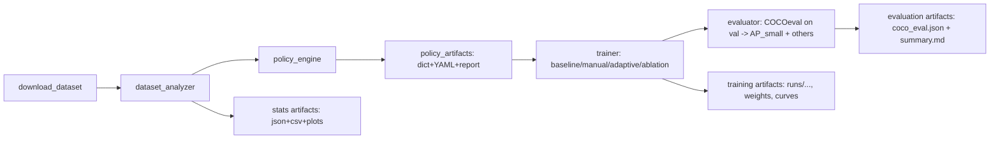

# Техническое задание на MVP и план работ после MVP для алгоритма адаптивного подбора аугментаций под small object detection

## Executive summary

Цель MVP — получить **воспроизводимый end‑to‑end пайплайн** для задачи `task=detect` на **VisDrone (детекция в изображениях)**:  
**(1)** подготовка датасета в YOLO‑формате, **(2)** анализ датасета по фиксированному набору признаков (bbox‑статистики, small_ratio, density, imbalance, размеры изображений, освещение), **(3)** генерация интерпретируемой политики аугментаций (правила + фиксированные пороги), **(4)** обучение **baseline / manual / adaptive + минимальный ablation**, **(5)** оценка метрик через **COCOeval** на val‑части после конвертации в COCO‑совместимый формат, включая **AP_small**, и сохранение всех артефактов (конфиги, отчёты, логи, json результатов).  

Критически важные ограничения, которые должны быть отражены в ТЗ и коде:

- **AP_small и “small”** вычисляются в COCO‑стиле по диапазонам площади: `small` = \([0, 32^2]\), `medium` = \([32^2, 96^2]\), `large` = \([96^2, 1e5^2]\) в пикселях площади. citeturn6view0  
- В entity["company","Ultralytics","yolo framework vendor"] `copy_paste` **поддержан только для segment**, а не для detect; значит для bbox‑only требуется **кастомный bbox‑copy‑paste** (онлайн / офлайн). citeturn3view0  
- Кастомные Albumentations‑трансформы (включая BBoxAwareCrop/CopyPaste) в Ultralytics **поддерживаются только через Python API**; их нельзя задать через CLI/YAML. citeturn4view0turn3view0  
- Передача `augmentations` **заменяет дефолтные Albumentations‑трансформы**, но “YOLO‑аугментации” (`mosaic`, `hsv_*`, `degrees` и т.д.) продолжают работать независимо. citeturn4view0  

Далее приведено ТЗ для MVP (реализация + эксперименты), затем backlog задач после успешного MVP.

## Границы MVP и основные допущения

**Зафиксированные решения для MVP (из ваших ответов)**

- Задача: `task=detect`.  
- Аннотации: исходный формат — YOLO (нормированные `xc yc w h`), но все площади/размеры в анализаторе считаются **в пикселях оригинального изображения**. citeturn5view0turn8view0  
- Порог “small/medium/large”: COCO‑style area ranges. citeturn6view0  
- `small_ratio`: object‑level доля объектов small на train.  
- Метрики: primary = **AP_small (COCOeval)**; вспомогательные = mAP(0.5:0.95), AP50, precision/recall overall и для small/tiny. citeturn6view0  
- Оценка: конвертируем VisDrone‑val в COCO‑совместимый формат и считаем COCOeval. citeturn6view0turn5view0  
- Признаки датасета (ядро): bbox area distribution (percentiles), small_ratio/tiny_ratio, density (objects_per_image и objects_per_Mpix), class imbalance (counts) + imbalance_ratio_small, image sizes, illumination (HSV V mean/std + contrast).  
- Плотность “dense”: стартовые пороги `objects_per_image ≥ 15` **или** `objects_per_Mpix ≥ 30` (фиксированные в MVP, затем калибруются).  
- Rect/multi_scale: **не использовать** ради стабильности и воспроизводимости. citeturn3view0  
- Tiling/chips: **не делать в MVP**, но оставить как расширение.  
- Crop: реализовать через кастомный Albumentations transform (BBoxAwareCrop) и подключать Python‑only. citeturn4view0turn8view0  
- BBox‑filtering при crop: `clip + min_visibility/min_area` (пример: min_visibility=0.3, min_area в пикселях). citeturn8view0turn2search19  
- Copy‑paste: для detect — **свой bbox‑only copy-paste**, с IoA/IoU ограничением (ориентир IoA≈0.3). Штатный Ultralytics `copy_paste` не использовать (он segment‑only). citeturn3view0turn4view0  
- Выход policy: Python‑dict → сохранять в YAML для репликации (с оговоркой: YAML не кодирует Albumentations‑pipeline). citeturn4view0turn3view0  
- Воспроизводимость: использовать `seed` и `deterministic` из Ultralytics; опционально — multi‑seed позже. citeturn3view0  
- Логирование: статистики, fired rules, итоговый конфиг, метрики и артефакты обучения. citeturn3view0turn4view0  
- Сравнение с AutoAug: в MVP не требовать полноценную реализацию AutoAug‑поиска для detection; вместо этого — **минимальный compute‑сравнитель** как исследовательская задача после MVP (или “пилот” на маленькой подзадаче/подвыборке). AutoAugment как концепт источника — первоисточник. citeturn1search0turn1search1  

**Не указан параметр, который требуется в ТЗ как конфиг‑переменная**  
Ниже параметры помечены как **«не указан»** и должны быть вынесены в `project_config.yaml` (или `settings.py`) с дефолтами:

- Модель Ultralytics (например `yolo26n.pt` / `yolo11n.pt`) — **не указан**; дефолт для MVP: `yolo26n.pt` (как в примерах Ultralytics). citeturn4view0turn5view0  
- Бюджет обучения (epochs/imgsz/batch/device) — **не указан**; дефолт MVP: быстрый этап (epochs=20, imgsz=640) и финальный (epochs=100, imgsz=640/960). VisDrone‑пример в документации использует imgsz=640 и 100 эпох как типовой сценарий. citeturn5view0  
- “tiny” порог (для tiny_ratio и отдельных метрик) — **не указан**; дефолт MVP: `tiny_area <= 16^2` (256 px²) как под‑диапазон внутри small (только для внутренних отчётов; AP_small остаётся COCO‑каноничным). COCOeval встроенного “tiny” не имеет, поэтому это будет кастомная метрика/доп. прогон. citeturn6view0  
- Метрика дисбаланса классов (кроме small‑variant) — **не указан**; дефолт MVP: `imbalance_ratio = max_count / max(1, min_count)` по **числу объектов**. Альтернативы (Gini/entropy) — в backlog.  

## Архитектура системы и контракты модулей

**Система должна состоять из модулей:** `download`, `analyzer`, `policy_engine`, `trainer`, `evaluator` и общего слоя `io/logging`. Это поддерживает вашу цель “интерпретируемая система”, где каждое решение прозрачно и воспроизводимо. citeturn4view0turn3view0  



**Рекомендуемая структура репозитория (обязательная для MVP)**  
(Дерево — требование к deliverable, допускается адаптация имён, но не смыслов.)

```text
project_root/
  README.md
  pyproject.toml (или requirements.txt)
  configs/
    project_config.yaml
    baseline.yaml
    manual.yaml
  src/
    data/
      visdrone_manager.py
      yolo_label_reader.py
    analysis/
      dataset_analyzer.py
      stats_schema.py
    policy/
      rule_engine.py
      policy_schema.py
    augmentation/
      policy_to_ultralytics.py
      albumentations_transforms.py
      object_bank.py
    training/
      train_runner.py
    evaluation/
      coco_converter.py
      coco_eval_runner.py
      metrics_report.py
    utils/
      io.py
      logging.py
      reproducibility.py
  runs/   (генерируется)
  artifacts/ (генерируется)
  tests/
    test_label_parsing.py
    test_area_bins.py
    test_coco_conversion.py
    test_policy_rules.py
```

**Контракты входов/выходов (обязательные)**

- `dataset_analyzer` вход: путь к `images/train`, `labels/train` (+ аналогично val), формат — YOLO normalized labels, изображения — оригинальные размеры. citeturn5view0turn8view0  
  выход: `dataset_stats.json` (строгая схема), `dataset_stats.csv` (плоская таблица), `plots/` (распределения bbox area, density).  
- `policy_engine` вход: `dataset_stats.json`; выход:  
  1) `policy_adaptive.json` (полная спецификация),  
  2) `policy_adaptive.yaml` (только Ultralytics‑совместимые scalar‑параметры),  
  3) `decision_report.json` (список fired rules + причины).  
- `trainer` вход: `policy_*.yaml` + (опционально) `policy_*.json` для Albumentations pipeline; выход: runs Ultralytics + `train_args.yaml` + `results.csv`/графики (Ultralytics). citeturn3view0turn4view0  
- `evaluator` вход: ground truth val в YOLO‑формате + predictions модели на val; выход: `coco_gt.json`, `coco_dt.json`, `coco_eval.json`, `summary.md` (таблица метрик). COCOeval вычисляет AP_small как стандартный элемент summary. citeturn6view0  

## Требования к реализации MVP

Ниже — требования в формате “что сделать” + “критерии приёмки” + “важные ссылки”.

### Требования к данным и подготовке VisDrone

**MVP‑требование D1.** Поддержать автоматическую подготовку VisDrone в YOLO‑структуре `images/{train,val,test}` и `labels/{train,val,test}`. Разрешить два режима:

- `mode=auto`: использовать совместимый с Ultralytics способ подготовки/конвертации VisDrone (как описано в документации, включая сплиты и наличие 10 классов). citeturn5view0  
- `mode=manual`: если датасет уже подготовлен, валидировать структуру и целостность (счёт файлов, наличие пар image↔label, допуски на пустые label).  

**Критерии приёмки D1:**
- Скрипт/модуль выводит отчёт о структуре (количество изображений train/val) и список найденных проблем. В документации Ultralytics указан ожидаемый `train: 6471 images`, `val: 548 images`. citeturn5view0  
- Для каждого изображения (train и val) можно восстановить оригинальные `W,H`.  

### Требования к анализатору датасета

**MVP‑требование A1.** Реализовать анализатор, который читает YOLO‑labels и изображения и считает признаки:

- bbox area в px² (на оригинальном изображении) + распределения (min, max, mean, median, p10/p25/p50/p75/p90/p95/p99).  
- `small_ratio` по COCO‑границам areaRng, `tiny_ratio` по `tiny_area <= 16^2` (tiny — конфиг). citeturn6view0  
- density: `objects_per_image`, `objects_per_Mpix` (МПикс = (W*H)/1e6).  
- class counts (по объектам), `imbalance_ratio` и `imbalance_ratio_small` (по small/tiny).  
- image sizes: распределение W,H, aspect ratio.  
- illumination: HSV V mean/std (яркость) и contrast как std яркости (определение контраста в MVP — фиксированное).  

**Критерии приёмки A1:**
- `dataset_stats.json` валидируется по вашей `stats_schema.py` (жёсткие типы и единицы измерения).  
- На 10 случайных изображениях визуальная проверка: bbox area и small/medium/large классификация совпадают с ручным подсчётом.  
- В отчёте явно указано, что COCO‑range small/medium/large соответствует COCOeval `areaRng`. citeturn6view0  

### Требования к rule-based policy engine

**MVP‑требование P1.** Реализовать `rule_engine`, который:

1) читает `dataset_stats.json`;  
2) вычисляет бинарные/категориальные флаги:  
- `is_small_heavy` (порог в конфиге, дефолт 0.5),  
- `is_dense` (порог по objects_per_image или objects_per_Mpix как задано),  
- `is_illum_var_high` (порог по std(V) в конфиге),  
- `is_imbalanced` и `is_small_imbalanced` (пороги в конфиге).  
3) генерирует **policy dict** (Ultralytics args + Albumentations pipeline spec) и `decision_report.json`.

**MVP‑требование P2.** Политика должна быть **интерпретируемой**: в `decision_report.json` каждая установка параметра должна иметь:
- имя правила,  
- условия (со значениями признаков),  
- выбранные параметры (до/после, если есть defaults).  

**Критерии приёмки P1–P2:**
- Policy строится детерминированно при фиксированном `seed`. citeturn3view0  
- `policy_adaptive.yaml` включает только параметры, поддерживаемые Ultralytics для detect (например `mosaic`, `hsv_*`, `degrees`, `scale`, `translate`, `fliplr/flipud`). Список и поддержка задач задаются конфигурацией Ultralytics. citeturn3view0  
- `decision_report.json` показывает минимум 1–3 активированных правила на VisDrone (ожидаемо: small‑heavy и часто dense). VisDrone по описанию содержит сцены от sparse до crowded и много bbox. citeturn5view0turn2search1  

**Минимальный набор правил MVP (обязательный)**  
(Числа ниже — дефолты, все должны быть настраиваемыми.)

- **R_mosaic:**  
  - если `is_dense==true` → `mosaic=0.7` (умеренный), иначе `mosaic=0.3`; `close_mosaic=10` (дефолт Ultralytics). citeturn3view0  
  - если `is_small_heavy==true` → ограничить “агрессивность” геометрии (см. ниже).  
- **R_geom_small_safe:**  
  - если `is_small_heavy==true` → уменьшить `scale` и `translate`, ограничить `degrees` (например degrees ≤ 5), `perspective=0`. Поддерживаемые параметры перечислены в конфиге. citeturn3view0  
- **R_flip:**  
  - `fliplr=0.5` (дефолт), `flipud` включать только если `allow_flipud=true` в конфиге (по умолчанию false). citeturn3view0  
- **R_photo:**  
  - если `is_illum_var_high==true` → слегка увеличить `hsv_v` и `hsv_s` (в пределах 0..1). citeturn3view0  
- **R_mixup_cutmix:**  
  - baseline: `mixup=0`, `cutmix=0`; adaptive включать только при `enable_mixup_cutmix=true` и при признаках “низкой вариативности” (в MVP допускается выключено). Эти параметры есть в Ultralytics для detect. citeturn3view0  

### Требования к модулю аугментаций и кастомным Albumentations transforms

**MVP‑требование U1.** Реализовать класс `AugmentationPolicy` (или эквивалент), который:

- принимает на вход **policy dict** (Ultralytics args + `albumentations_spec`),  
- умеет:
  1) возвращать `ultralytics_train_args: dict[str, Any]`  
  2) возвращать `albumentations_transforms: list` (реальные объекты transforms) **для Python API**  
  3) сериализовать policy в:  
     - `policy.yaml` (только Ultralytics args),  
     - `policy.json` (полная спецификация, включая albumentations transforms в виде “имя+параметры”).  

**Почему так:** кастомные Albumentations‑трансформы для Ultralytics задаются Python API‑параметром `augmentations`, который **не поддерживается в CLI/YAML**, и при этом эти transforms заменяют дефолтный Albumentations‑набор, оставляя YOLO‑аугментации активными. citeturn4view0turn3view0  

**MVP‑требование U2. BBoxAwareCrop.** Реализовать bbox‑совместимую crop‑аугментацию как Albumentations‑transform (можно обернуть существующий BBox‑aware crop). Требования:

- Использовать bbox‑параметры фильтрации `min_visibility` и `min_area` (configurable), включить клиппинг bbox. Albumentations документирует эти параметры и bbox‑safe cropping стратегии. citeturn8view0turn2search19  
- Не допускать “пустых” (без боксов) сэмплов без явного разрешения: либо выбирать crop стратегии, гарантирующие доступность bbox (например AtLeastOneBboxRandomCrop / RandomSizedBBoxSafeCrop), либо делать fallback на исходный кадр. citeturn8view0  

**MVP‑требование U3. BBox‑only copy‑paste.** Реализовать bbox‑copy‑paste для `detect` (без масок):

- Суть: вырезать прямоугольные патчи по bbox (вместе с фоном) и вставлять в другие изображения; обновлять bbox для вставленного объекта.  
- Placement: случайная позиция с ограничением перекрытий по IoU/IoA (ориентир порог 0.3 как стартовый).  
- Самплинг доноров: при `is_small_imbalanced==true` отдавать приоритет small/tiny объектам “хвостовых” классов.  
- Реализация должна быть либо:
  - **онлайн** (на лету из текущего батча/датасета), либо  
  - **через object bank** (предварительно собранный набор патчей + метаданные).  

**Критерии приёмки U2–U3:**
- Unit‑test: после применения transform все bbox внутри границ изображения, не имеют отрицательных размеров, корректно синхронизированы со списком labels. Это ключевая причина использования Albumentations (оно обновляет bbox синхронно с пикселями при spatial transforms). citeturn8view0  
- В документации указано ограничение Ultralytics: `copy_paste` параметр есть, но **только для segment**, поэтому bbox‑copy‑paste является отдельным модулем проекта. citeturn3view0  

### Требования к обучению (trainer)

**MVP‑требование T1.** Реализовать `train_runner.py`, который запускает минимум 3 режима:

- `baseline`: Ultralytics default training args (как в конфиге по умолчанию) + фиксированные `seed`, `deterministic=True`. citeturn3view0  
- `manual`: “разумная small‑policy” (статический конфиг, задаётся в `configs/manual.yaml`).  
- `adaptive`: policy из `policy_engine` (Ultralytics args + кастомные augmentations через Python API). citeturn4view0turn3view0  

**MVP‑требование T2.** Реализовать минимум 2 ablation‑запуска:

- `adaptive_no_mosaic`: как adaptive, но `mosaic=0` (проверка вклада mosaic).  
- `adaptive_no_custom_albu`: как adaptive, но без `augmentations` (убрать BBoxAwareCrop и bbox‑copy‑paste), чтобы измерить вклад кастомных aугментаций.  

**Критерии приёмки T1–T2:**
- Все запуски создают отдельные run‑директории (использовать `project`, `name`, `exist_ok`) и сохраняют `train_args.yaml`/логи. citeturn3view0  
- Для `adaptive` запуск осуществляется через Python API (обязательно), т.к. `augmentations` Python‑only. citeturn4view0turn3view0  

**Замечание по “baseline fairness” (обязательное к реализации):**  
Ultralytics может автоматически применять Albumentations‑аугментации, если пакет установлен; это может влиять на baseline. В MVP необходимо иметь конфиг‑флаг `baseline_disable_albumentations` и один из двух подходов:

- либо запуск baseline в окружении без Albumentations,  
- либо явный контроль через внутренние механизмы проекта (например, запуск baseline в отдельном venv/контейнере).  

Это важно, потому что кастомные `augmentations` заменяют дефолтный Albumentations‑набор, а не добавляются поверх него. citeturn4view0  

### Требования к оценке (COCO conversion + COCOeval)

**MVP‑требование E1.** Реализовать конвертер YOLO→COCO для **val‑части VisDrone**:

- `coco_gt.json`: images (id, file_name, width, height), annotations (bbox xywh px, area px², category_id), categories (10 классов). Ultralytics указывает классы VisDrone и структуру. citeturn5view0  
- `coco_dt.json`: predictions модели на val в COCO detection формате (bbox xywh px, score, category_id).  

**MVP‑требование E2.** Реализовать COCOeval runner:

- `iouType='bbox'`  
- собрать и сохранить: `AP@[.5:.95]`, `AP50`, `AP75`, `AP_small`, `AP_medium`, `AP_large`, а также `AR_small` (как минимум). COCOeval использует areaRng/areaRngLbl и summary включает AP_small. citeturn6view0  

**(Опционально внутри MVP, но желательно)** — `tiny`‑метрики: добавить дополнительный прогон COCOeval с кастомным area range `[0, 16^2]` и сохранить как `AP_tiny`. Важно явно написать, что это “нестандартное расширение COCOeval”. COCOeval позволяет использовать кастомные параметры, хотя `summarize()` предназначена для дефолтных настроек (нужно написать своё summary). citeturn6view0  

**Критерии приёмки E1–E2:**
- На одном тестовом примере (1–5 изображений) COCOeval успешно запускается и выдаёт численные метрики.  
- Метрика AP_small совпадает по смыслу с COCOeval `areaRngLbl='small'`. citeturn6view0  

## План экспериментов MVP и формат отчётности

**MVP‑экспериментальный протокол (строго фиксируем):**

1) **Dataset prep**: VisDrone YOLO‑формат, сплиты train/val по Ultralytics. citeturn5view0  
2) **Анализ train**: построить `dataset_stats.json/csv` + графики.  
3) **Сгенерировать 3 политики**:
   - baseline (Ultralytics defaults),
   - manual (статический yaml),
   - adaptive (rule‑engine). citeturn3view0turn4view0  
4) **Обучение**:
   - быстрый этап (sanity): малая модель / меньше эпох / subset через `fraction` (Ultralytics поддерживает `fraction` как долю датасета). citeturn3view0  
   - финальный этап: целевые epochs/imgsz (по конфигу).  
5) **Оценка**: COCOeval на val для каждой модели. citeturn6view0  
6) **Ablation**: минимум 2 ablation‑прогона (см. T2).  
7) **Итоговый отчёт**: единая таблица метрик + указание времени:  
   - overhead анализа/генерации policy (секунды/минуты),  
   - время обучения (GPU‑часы),  
   - итоговые AP_small / mAP.  

**Почему COCOeval как “source of truth” для AP_small:**  
COCOeval формально задаёт area ranges и выдаёт AP_small как часть стандартизованного summary для bbox‑детекции. citeturn6view0turn2search0  

**Отдельное замечание про исследования AutoAug/SA‑AutoAug:**  
AutoAugment и SA‑AutoAug — это класс search‑подходов, где политика выбирается по валидации и может требовать дополнительных обучений/поиска. В MVP допускается лишь “пилотный” сравниватель (ограниченный бюджетом), а полноценное сравнение выносится в backlog. citeturn1search0turn1search1  

## Deliverables MVP и критерии готовности

| Deliverable | Формат/расположение | Definition of Done (проверяемо) |
|---|---|---|
| Подготовка VisDrone (валидатор/скачивание/структура) | `src/data/visdrone_manager.py` + лог | Скрипт подтверждает структуру `images/labels` и числа train/val, выдаёт ошибки несоответствий. citeturn5view0 |
| Анализатор датасета | `src/analysis/dataset_analyzer.py` | Генерирует `artifacts/stats/dataset_stats.json` и `csv`, валидируемые схемой; считает small_ratio по COCO ranges. citeturn6view0 |
| Rule engine + отчёт объяснимости | `src/policy/rule_engine.py` | Создаёт `policy_adaptive.json/yaml` + `decision_report.json`; отчёт содержит причины/значения признаков. |
| Модуль аугментаций (policy → Ultralytics + Albumentations) | `src/augmentation/*` | `augmentations` поддержаны Python API only; spec сериализуется в JSON, Ultralytics args в YAML. citeturn4view0turn3view0 |
| Кастомные transforms: BBoxAwareCrop + bbox-copy-paste | `albumentations_transforms.py` | Unit‑tests на корректность bbox; используется min_visibility/min_area. citeturn8view0turn2search19 |
| Trainer | `src/training/train_runner.py` | Запускает baseline/manual/adaptive и 2 ablation; сохраняет отдельные run‑директории и конфиги. citeturn3view0 |
| COCO конвертер + оценка | `src/evaluation/*` | Создаёт `coco_gt.json`, `coco_dt.json`, `coco_eval.json`, извлекает AP_small. citeturn6view0 |
| Итоговый отчёт MVP | `artifacts/reports/mvp_report.md` | Есть таблица метрик и вывод по AP_small, есть ссылки на политики и decision_report. |

## Backlog задач после успешного MVP

Backlog сгруппирован по типу: “исследовательские улучшения” и “инженерные усиления”. Порядок — рекомендуемый (P0 = сразу после MVP, P1 = дальше, P2 = опционально).

| Приоритет | Задача | Что добавить | Почему важно / источники |
|---:|---|---|---|
| P0 | Tiling/chips для overhead датасетов | Реализовать offline или online tiling для DOTA/xView; связать с scale‑aware правилами | Overhead датасеты часто имеют большие изображения и мелкие объекты; tiling повышает “эффективное разрешение” объектов. DOTA как aerial benchmark с большими изображениями — типичный кандидат. citeturn5view0turn2search1 |
| P0 | Transfer‑тесты | COCO как контроль + DOTA/xView как aerial | Нужны для доказательства “policy зависит от структуры датасета”. COCO — стандартный бенчмарк. citeturn2search0turn6view0 |
| P0 | Multi‑seed репликация | 3–5 seed и среднее±std по AP_small | Усиливает научную достоверность, снижает риск случайного выигрыша; Ultralytics поддерживает `seed`, `deterministic`. citeturn3view0 |
| P0 | Scene difficulty признаки | Occlusion/truncation (VisDrone атрибуты) как факторы правил | VisDrone содержит богатые аннотации, включая occlusion/truncation; можно делать более точные правила. citeturn2search1turn5view0 |
| P1 | Калибровка порогов | Перейти от фиксированных порогов к квантильным/частично обучаемым | Уменьшает ручную эвристику; можно сделать “data‑driven thresholds” без полного AutoML. Связано с идеологией AutoDA. citeturn1search0turn1search1 |
| P1 | Сравнение с AutoAug/SA‑AutoAug по бюджету | Малый pilot: ограниченный поиск по политике vs rule‑engine overhead | Полноценный AutoAug для detection дорогой; SA‑AutoAug формализует scale‑aware поиск. Сделать ограниченный, честный по бюджету тест. citeturn1search0turn1search1 |
| P1 | Интеграция Ultralytics Tuner | Использовать rule‑policy как init, затем ограниченный `model.tune()` по небольшому подмножеству параметров | Ultralytics описывает genetic‑tuning и артефакты результатов; полезно как “после MVP”. citeturn7view0 |
| P1 | Улучшенный Copy‑Paste | Mask‑based (если появятся маски) или “context‑aware” копипаст | В detect‑bbox patch‑realism ограничен; mask‑copy‑paste — сильная методика в сегментации. citeturn1search15turn3view0 |
| P2 | Mosaic‑улучшения | Варианты Select‑Mosaic (dense small object scenes) | Идейно релевантно dense small objects; потребуется кастомная реализация, не штатная. citeturn1search2turn3view0 |
| P2 | Риск‑реестр и guardrails | Формализованный risk log + автоматические проверки (“нет пустых батчей”, “bbox sanity”, “метрики стабильны”) | Улучшает инженерную зрелость и воспроизводимость, особенно при кастомных трансформах. citeturn8view0turn4view0 |

## Источники и обязательные ссылки для документации

Ниже — минимальный набор первоисточников, который должен быть включён в `README.md` и/или `docs/` как раздел “References” (в MVP достаточно этого набора).

- Ultralytics: список параметров аугментаций (включая `mosaic`, `mixup`, `cutmix`), ограничения `copy_paste` (segment‑only), `augmentations` (Python API only), `seed`, `deterministic`, `close_mosaic`. citeturn3view0  
- Ultralytics: гайд по аугментациям, включая правило “augmentations заменяет дефолтные Albumentations transforms” и “YOLO augmentations остаются активными”. citeturn4view0  
- Ultralytics: страница VisDrone (структура датасета, сплиты, классы, число bbox, ссылки/цитирование). citeturn5view0  
- COCO paper (как канонический источник бенчмарка в контексте метрик/протокола). citeturn2search0  
- COCOeval (pycocotools): `areaRng` для small/medium/large и наличие AP_small в summary det‑метрик. citeturn6view0  
- VisDrone benchmark paper (“Vision Meets Drones: A Challenge”) как академический источник по датасету и сложности условий (scale variation, occlusion и т.д.). citeturn2search1  
- Albumentations bbox augmentation: min_visibility/min_area, bbox‑safe cropping стратегии и форматы bbox (включая yolo). citeturn8view0  
- AutoAugment (как первоисточник “поиск политик аугментации” для сравнения подходов). citeturn1search0  
- Scale‑Aware AutoAug for Detection (как первоисточник scale‑aware AutoDA для детекции; важен для будущих сравнений и теоретического обоснования scale‑логики). citeturn1search1turn1search5  
- Select‑Mosaic (как пример специализированной плотностной Mosaic‑логики для dense small objects — в backlog). citeturn1search2