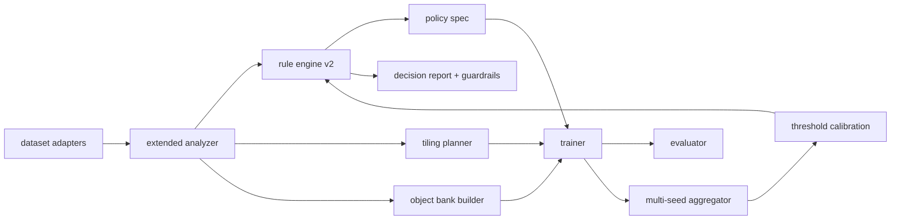
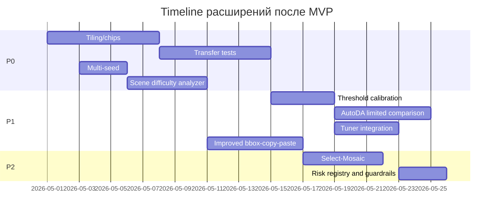
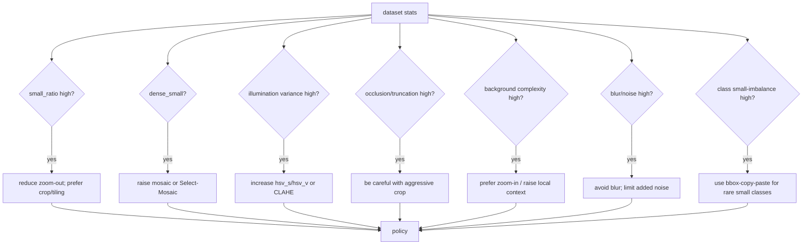

# Расширенное ТЗ для задач после MVP по adaptive rule-based подбору аугментаций для детекции малых объектов

## Executive summary

После успешного MVP следующая фаза должна расширить систему в трёх направлениях: **обобщаемость**, **качество правил** и **богатство пространства аугментаций**. Для вашей темы это означает: добавить **tiling/chips** и перенос на большие aerial/overhead датасеты, ввести **multi-seed и более строгую воспроизводимость**, расширить анализатор признаками **occlusion/truncation**, кластерности и фоновой сложности, затем перейти к более сильным исследованиям — **калибровке порогов**, ограниченному сравнению с **AutoAugment / RandAugment / Scale-Aware AutoAug**, интеграции с **Ultralytics Tuner**, улучшенному **bbox-only copy-paste** и, наконец, специализированным стратегиям вроде **Select-Mosaic**. Такой порядок логичен, потому что он сначала повышает инженерную надёжность и переносимость, а уже потом добавляет более дорогие исследовательские ветки. citeturn5view5turn5view4turn8view1turn12search0turn3search0turn3search1

Для LLM-агента важны не только идеи, но и **чёткие контракты модулей**, ожидаемые артефакты, критерии приёмки и ограничения платформы. В частности, built-in параметры Ultralytics для `detect` покрывают геометрию, фотометрию, `mosaic`, `mixup`, `cutmix`, но **`copy_paste` официально относится только к `segment`**, а кастомные Albumentations-трансформы передаются через `augmentations` **только в Python API** и заменяют дефолтный Albumentations-блок, тогда как “YOLO-специфичные” аугментации продолжают работать отдельно. Это должно быть явно зафиксировано в документации и в архитектуре расширений. citeturn5view5turn5view4turn6view5turn6view2

Ниже дано расширенное ТЗ по backlog-задачам P0, P1 и P2, затем — расширенный каталог аугментаций, список новых анализаторов и статистик, обзор релевантных работ и набор mermaid-диаграмм/конфигов, которые следует включить в документацию проекта. citeturn4view1turn8view0turn11view0

## Приоритеты и рекомендуемый порядок реализации

Практически разумный порядок после MVP такой: сначала **P0: tiling/chips**, **transfer tests**, **multi-seed**, **scene difficulty**; затем **P1: калибровка порогов**, **ограниченное сравнение с AutoDA-подходами**, **интеграция Tuner**, **улучшенный copy-paste**; и только после этого **P2: Select-Mosaic / Mosaic-расширения** и **risk registry / guardrails**. Причина проста: P0 даёт наибольший эффект на надёжность вывода и переносимость на другие aerial-домены, а P1 и P2 уже усиливают исследовательскую глубину и переносят проект из “хорошей инженерии” в “сильную исследовательскую платформу”. Для aerial/overhead датасетов большие изображения, кластеризация объектов и сильная неоднородность масштаба — не исключение, а норма, что подтверждают DOTA, xView, VisDrone, ClusDet и работы по tiling. citeturn11view0turn11view1turn9search1turn3search1turn4view7

Порядок реализации стоит зафиксировать и в документации, и в issue-tracker, чтобы LLM-агент мог работать итеративно: сначала изменения, которые **не ломают текущий MVP-контур**, затем дорогие ветви, требующие дополнительного вычислительного бюджета. Особенно это касается сравнений с AutoAugment / SA-AutoAug и любого тюнинга, поскольку Ultralytics прямо рекомендует заранее задавать tuning budget, а Tuner работает как эволюционный процесс по многим итерациям перезапуска обучения. citeturn8view0turn8view1

## Расширенное ТЗ по backlog-задачам

### Tiling и chips для aerial и overhead-сцен

**Цель.** Добавить поддержку `offline tiling`, `online tiling` и `object-centric chips` для large-scale aerial/overhead датасетов, чтобы снизить потерю детализации small objects при приведении входа к фиксированному `imgsz`. Это особенно важно для DOTA/xView-подобных изображений, где размер одного кадра может многократно превышать VisDrone, а объекты занимают очень малую долю пикселей. citeturn9search1turn11view1turn4view7turn3search1

**Вход / выход.**  
Вход: исходные изображения и YOLO/COCO-аннотации, конфиг tiling, режим `offline|online|object_centric`.  
Выход: либо новый tiled-датасет на диске, либо runtime-generator тайлов, плюс `tile_index.json` с отображением `original_image -> tiles`, статистика покрытия объектов и лог отброшенных/усечённых bbox.  

**Подзадачи.** Реализовать три режима:  
(1) `offline tiling` с предгенерацией тайлов и аннотаций;  
(2) `online tiling` на этапе dataloader;  
(3) `object-centric chips`, где тайл центрируется на small/tiny объектах или кластерах объектов.  
Далее реализовать clip/filter bbox, контроль дубликатов между тайлами, поддержку overlap, а также обратное mapping-правило для инференса и сборки предсказаний при необходимости. Для `object-centric` режима нужно отдельно реализовать sampling policy, чтобы не разрушить распределение контекстов и не переучить модель на “слишком удобных” сценах. Решение нужно встраивать как отдельный модуль, а не смешивать с базовым анализатором/правилами. citeturn4view7turn3search1turn4view4

**Критерии приёмки.**  
DoD:  
(а) на тестовом наборе тайлинг не создаёт некорректных bbox;  
(б) есть отчёт о покрытии объектов тайлами;  
(в) для DOTA/xView и для подмножества VisDrone можно запустить обучающий пайплайн без ручного вмешательства;  
(г) есть ablation `no_tiling vs offline vs online vs object-centric`;  
(д) есть оценка compute overhead.  

**Сложность.** High.  
**Срок.** 4–8 дней на первую стабильную реализацию, ещё 3–5 дней на ablation и отладку.  
**Зависимости.** Bbox-safe crop/filtering, evaluator, логирование.  
**Риски.** Дублирование объектов на соседних тайлах, перекос распределения контекста, завышение recall без честного учёта merge/postprocess на инференсе. Эти риски особенно типичны для aerial detection и уже мотивировали работы по tiling и clustered detection. citeturn4view7turn3search1turn11view3

### Transfer tests на COCO, DOTA и xView

**Цель.** Доказать, что rule-based система действительно адаптивна и меняет policy в зависимости от структуры данных, а не просто повторяет VisDrone-специфичную эвристику. COCO нужен как “универсальный” контроль, DOTA и xView — как overhead/aerial контекст с большими изображениями и сложным scale distribution. citeturn21search0turn9search1turn11view1turn11view2

**Вход / выход.**  
Вход: датасет-конвертеры, dataset analyzer, policy engine, train/eval pipeline.  
Выход: по каждому датасету — `dataset_stats.json`, `policy_report.json`, таблица метрик, сравнение различий в policy и короткий текстовый вывод “почему политика поменялась”.  

**Подзадачи.** Добавить адаптеры под COCO, xView и DOTA/OBB. Для COCO достаточно COCO-format + COCOeval. Для xView — converter в YOLO/COCO + масштабные проверки, поскольку там много классов и крупные сцены. Для DOTA следует решить, идёт ли ветка как `detect` с axis-aligned bbox после проекции, либо как `obb`-эксперимент; второй вариант честнее к датасету, но потребует отдельного трека экспериментов. Важно сохранить единый schema-формат статистик и единый интерфейс rule-engine. citeturn21search0turn9search2turn9search13

**Критерии приёмки.**  
DoD:  
(а) один и тот же analyzer корректно выдаёт статистики для VisDrone, COCO и минимум одного overhead датасета;  
(б) adaptive policy по крайней мере по двум признакам реально различается между датасетами;  
(в) отчёт содержит AP_small или аналогичный by-area breakdown;  
(г) есть сравнительная матрица “dataset → triggered rules”.  

**Сложность.** High.  
**Срок.** 5–10 дней, в зависимости от объёма конвертеров.  
**Зависимости.** Tiling/chips для overhead-датасетов, evaluator, class mapping layer.  
**Риски.** Несопоставимость метрик при OBB vs bbox, разные class spaces, риск “подгонки” порогов под VisDrone и переносного провала на COCO/xView. citeturn18view2turn9search1turn11view1

### Multi-seed и статистическая устойчивость

**Цель.** Перевести выводы из режима “single-run” в режим “устойчивый результат”, чтобы улучшения adaptive policy не зависели от одного удачного seed. Ultralytics поддерживает `seed` и `deterministic`; это даёт базу для стандартизации повторных прогонов. citeturn20view1

**Вход / выход.**  
Вход: список policy-конфигов, список seeds, train/eval pipeline.  
Выход: агрегированный отчёт `metrics_aggregate.csv/json` с mean/std, доверительными интервалами или хотя бы mean±std.  

**Подзадачи.** Реализовать orchestrator для набора seeds, стандартизовать именование run-директорий, добавить слой агрегации результатов, отдельно сохранять сырые `results.csv/json` и решать проблему “run failed / partial run”. Для P0 достаточно 3 seeds на baseline/manual/adaptive и 1–2 seeds на ablation. Для later stage можно расширить до 5 seeds и непараметрических сравнений. citeturn20view1turn8view0

**Критерии приёмки.**  
DoD:  
(а) есть единая команда “evaluate seeds”;  
(б) все seed-результаты агрегируются автоматически;  
(в) отчёт выводит mean/std по AP_small, mAP, AP50;  
(г) документация фиксирует, какие выводы считаются устойчивыми.  

**Сложность.** Medium.  
**Срок.** 1–3 дня.  
**Зависимости.** Базовый trainer/evaluator, стандартизированные имена экспериментов.  
**Риски.** Рост compute cost и конфликт reuse-кэшей/имен run-директорий. citeturn20view1turn8view0

### Scene difficulty и атрибуты сложности

**Цель.** Добавить в анализатор свойства сцены, которых не было в MVP: `occlusion`, `truncation`, crowding/clusteredness, фон/текстура/blur/noise. VisDrone изначально содержит атрибуты occlusion/truncation, а aerial-detection литература систематически подчёркивает проблемы плотных кластеров, сильной вариативности масштаба и сложного фона. citeturn11view0turn3search1turn11view3

**Вход / выход.**  
Вход: датасет + расширенный parser атрибутов + изображения.  
Выход: `scene_difficulty.json` и расширенный `dataset_stats_extended.json`.  

**Подзадачи.** Расширить parser VisDrone-аннотаций так, чтобы использовать occlusion/truncation при наличии. Добавить вычисление кластерности объектов, edge density, blur/noise surrogates, background complexity и per-class small_ratio. Затем ввести отдельный слой `difficulty_rules`, который регулирует интенсивность фотометрии, crop-логики, bbox-copy-paste и tiling. Правила должны быть объяснимыми и выводиться в decision report. citeturn11view0turn10search1turn10search4turn10search3

**Критерии приёмки.**  
DoD:  
(а) расширенный анализатор запускается на VisDrone без ручных правок;  
(б) генерируются новые признаки с документацией формул;  
(в) минимум 2 новых признака реально участвуют в rule-engine;  
(г) есть ablation “без scene difficulty”.  

**Сложность.** Medium.  
**Срок.** 2–5 дней.  
**Зависимости.** Analyzer schema, decision report, логирование изображений.  
**Риски.** Пороговые значения сильно зависят от домена; существует риск сделать признаки слишком шумными и переусложнить rule-engine. citeturn11view0turn10search1turn10search3

### Калибровка порогов rule-engine

**Цель.** Перейти от полностью фиксированных порогов MVP к “data-informed” порогам: либо квантильным, либо полуобучаемым, но без полного отказа от интерпретируемости. Это естественный шаг между ручной инженерией и дорогим AutoDA‑поиском. citeturn2search0turn1search1turn4view5

**Вход / выход.**  
Вход: исторические `dataset_stats`, результаты baseline/manual/adaptive, список конфигурируемых порогов.  
Выход: `threshold_profiles.yaml`, отчёт о чувствительности порогов и обновлённый `rule_engine_config.yaml`.  

**Подзадачи.** Реализовать три режима:  
(1) fixed thresholds;  
(2) quantile thresholds (`Q25/Q50/Q75` от train stats);  
(3) constrained search по небольшому числу порогов.  
Для каждого режима — провести sensitivity analysis, отрисовать зависимость метрик от порогов и решить, какие пороги остаются “жёсткими” по стандарту, а какие можно адаптировать. COCO areaRng должны остаться фиксированными, а плотность, blur/noise или illumination thresholds можно переводить в датасет-зависимую форму. citeturn18view2turn8view0turn4view5

**Критерии приёмки.**  
DoD:  
(а) любой порог rule-engine может задаваться тремя режимами;  
(б) есть отчёт по чувствительности хотя бы для `small_ratio`, density и illumination;  
(в) decision report ясно пишет, какой режим порога использован.  

**Сложность.** Medium.  
**Срок.** 2–4 дня.  
**Зависимости.** Multi-seed, стабильный evaluator.  
**Риски.** Потеря объяснимости, подгонка под один датасет, рост вариативности результатов при малом числе прогонов. citeturn8view0turn4view5

### Ограниченное сравнение с AutoAugment, RandAugment и Scale-Aware AutoAug

**Цель.** Добавить честный исследовательский baseline “поиск/автоматизация против rule-based”, но в ограниченном бюджете. Это нужно не для полного воспроизведения всех search-методов, а чтобы показать, что ваш подход выигрывает по интерпретируемости и вычислительной цене. AutoAugment формализует поиск политик, RandAugment упрощает пространство поиска, а Scale-Aware AutoAug показывает, почему object detection требует специального scale-aware пространства и почему search cost может быть серьёзным. citeturn2search0turn1search1turn4view5

**Вход / выход.**  
Вход: подвыборка датасета или reduced-budget setup, baseline search recipes.  
Выход: таблица “качество / GPU-часы / число прогонов / интерпретируемость”.  

**Подзадачи.** Не пытаться переносить классификационные AutoAugment/RandAugment “как есть” на detect без оговорок. Реализовать ограниченный proxy-бенчмарк:  
(1) классификационный AutoAug/RandAug — только как reference на вспомогательной задаче или через внешнюю реализацию,  
(2) ограниченный поиск по 3–5 detect-совместимым параметрам,  
(3) теоретическое и эмпирическое сравнение с rule-engine по бюджету.  
Важно зафиксировать budget fairness: одинаковый максимум GPU-часов или число обучений. citeturn2search0turn1search1turn4view5

**Критерии приёмки.**  
DoD:  
(а) есть таблица budget-vs-quality;  
(б) budget явным образом зафиксирован;  
(в) сравнение не подменяет main pipeline и не ломает воспроизводимость;  
(г) в отчёте отдельно указано, что classification-only `auto_augment` Ultralytics не является готовым аналогом для `task=detect`. citeturn19view2turn19view3turn2search0turn1search1

**Сложность.** High.  
**Срок.** 4–7 дней.  
**Зависимости.** Multi-seed, compute budget tracker, reproducibility layer.  
**Риски.** Нечестное сравнение из-за разного search space, чрезмерный compute cost, методологический drift от основной темы. citeturn8view0turn4view5

### Интеграция Ultralytics Tuner после rule-based инициализации

**Цель.** Проверить “hybrid mode”: сначала rule-engine задаёт интерпретируемый policy prior, затем Ultralytics Tuner локально донастраивает ограниченный поднабор параметров. Tuner в Ultralytics эволюционно мутирует гиперпараметры и повторно запускает train/eval, сохраняя NDJSON и лучшие конфиги. citeturn8view1turn8view0

**Вход / выход.**  
Вход: adaptive policy, список tunable параметров и границ.  
Выход: `best_hyperparameters.yaml`, `tune_results.ndjson`, сравнительный отчёт `adaptive_vs_adaptive+tuned.md`.  

**Подзадачи.** Ограничить search space только теми параметрами, которые уже активны/разрешены rule-engine, например `mosaic`, `hsv_v`, `hsv_s`, `degrees`, `translate`, `scale`. Запретить Tuner менять принципиальные дискретные решения без отдельного флага, например “use tiling” или “use bbox-copy-paste”. Встроить resume, лог budget и возможность запускать tuning поверх нескольких seeds или только поверх одного canonical seed. citeturn8view1turn8view0

**Критерии приёмки.**  
DoD:  
(а) Tuner можно запустить поверх adaptive policy одной командой;  
(б) search space ограничиваем и сериализуем;  
(в) результаты сравниваются не только по качеству, но и по стоимости;  
(г) документация описывает, что tuning — опциональная фаза “после” rule-engine, а не его замена.  

**Сложность.** Medium.  
**Срок.** 2–4 дня.  
**Зависимости.** Stable adaptive policy, compute tracker.  
**Риски.** Tuner может компенсировать ошибочные правила, скрывая слабые места rule-engine; кроме того, tuning легко разрастается по бюджету. citeturn8view1turn8view0

### Улучшенный bbox-only copy-paste

**Цель.** Развить MVP-реализацию bbox-copy-paste в полноценный object-level augmentation модуль для detect-задачи. Для вашей постановки это особенно важно, потому что built-in `copy_paste` в Ultralytics сегментационный, а bbox-only версия нужна именно для detect pipeline и может адресовать long-tail классы и дефицит small instances. citeturn5view5turn2search2turn2search3

**Вход / выход.**  
Вход: object bank или on-the-fly sampler, правила выбора донора, правила размещения.  
Выход: runtime transform + диагностический лог вставок (`paste_log.jsonl`) + ablation report.  

**Подзадачи.**  
(1) перейти от “случайной вставки” к выбору доноров по классу, масштабу, освещению и резкости;  
(2) добавить режимы `rare_class_priority`, `small_priority`, `context_matched`;  
(3) поддержать `hard negative` режим, когда вставка создаёт умеренные коллизии/окклюзии;  
(4) исследовать object bank caching и pre-extracted patches;  
(5) для размытия границ патча добавить простую blending-логику.  
Нужно сохранить интерфейс так, чтобы later можно было перейти к mask-based copy-paste, если появятся сегментационные аннотации. citeturn2search2turn2search3turn5view5

**Критерии приёмки.**  
DoD:  
(а) bbox-copy-paste имеет не менее двух стратегий выбора донора и двух стратегий placement;  
(б) есть маршрут отладки, который визуализирует удачные и отвергнутые вставки;  
(в) есть ablation `none / bbox-copy-paste simple / bbox-copy-paste improved`;  
(г) отчёт отдельно показывает влияние на редкие классы и на AP_small.  

**Сложность.** High.  
**Срок.** 4–6 дней.  
**Зависимости.** Expanded analyzer, logging, class imbalance stats.  
**Риски.** Нереалистичный контекст, “загрязнение” датасета патчами с фоном, переусиление редких классов так, что падает precision. citeturn2search2turn2search3turn5view5

### Mosaic-расширения и Select-Mosaic

**Цель.** Добавить density-aware варианты Mosaic после того, как заработают expanded analyzers и transfer-tests. Select-Mosaic предлагает fine-grained region selection: перед сборкой мозаики вычисляется density, более плотное изображение помещается в большую маску/область, что повышает вероятность появления dense small-object сцен в обучении. citeturn14view0

**Вход / выход.**  
Вход: статистики плотности, mosaic mask generator, параметр `S` или аналог, определяющий вероятность selection stage.  
Выход: custom mosaic transform, параметризированный лог selection decisions, ablation по `S`.  

**Подзадачи.** Реализовать density estimator на уровне candidate images, затем повторить идею “картинка с максимальной плотностью → крупнейшая область mosaic mask”. Обязательна обратная совместимость: если `S=0`, поведение должно совпадать со стандартным Mosaic; если `S>0`, должен работать selection step. В отчёте надо показывать, как новая стратегия меняет распределение плотности в обучающих батчах. В оригинальной работе Select-Mosaic приводятся как абляции по `S`, так и результаты на VisDrone2019 и AI-TOD. citeturn14view0

**Критерии приёмки.**  
DoD:  
(а) есть параметр `select_mosaic_prob` или `S`;  
(б) есть ablation не менее чем для 3 значений `S`;  
(в) adaptive policy умеет включать standard Mosaic или Select-Mosaic в зависимости от density;  
(г) есть визуализация sampled mosaics.  

**Сложность.** High.  
**Срок.** 3–5 дней.  
**Зависимости.** Density analyzer, custom transform infrastructure.  
**Риски.** Завышение доли crowd scenes и ухудшение общей mAP на неплотных сценах; усложнение explainability, если правило станет слишком “непрозрачным”. citeturn14view0turn5view6

### Risk registry и guardrails

**Цель.** Формализовать риски проекта и автоматические предохранители. После MVP это уже не “опция”, а способ сделать систему пригодной для долгого evolution cycle и для работы LLM-агента без ручной проверки на каждом шаге. Наибольшие риски в такой системе — некорректные bbox после custom transforms, неустойчивые пороги, нечестные сравнения и переобучение на искусственно созданных сценах. citeturn4view4turn20view1

**Вход / выход.**  
Вход: pipeline events, валидационные проверки, логи обучения и аугментаций.  
Выход: `risk_registry.yaml`, `guardrail_checks.py`, `sanity_report.md`.  

**Подзадачи.** Реализовать набор автоматических проверок:  
(1) bbox sanity after transform;  
(2) fraction of empty samples / dropped boxes;  
(3) distribution drift after augmentation;  
(4) reproducibility check across reruns;  
(5) budget and artifact completeness check.  
Нужно, чтобы каждый custom transform имел встроенный self-check и чтобы rule-engine мог отказаться от слишком агрессивной policy, если статистика после dry-run противоречит ожидаемому поведению. citeturn4view4turn20view1

**Критерии приёмки.**  
DoD:  
(а) падение любого guardrail прерывает запуск или помечает его как invalid;  
(б) sanity-report создаётся автоматически;  
(в) минимум 5 guardrails покрывают data, transforms, training и evaluation.  

**Сложность.** Medium.  
**Срок.** 2–3 дня.  
**Зависимости.** Logging, analyzer, trainer, evaluator.  
**Риски.** Избыточная строгость guardrails и ложные срабатывания; слишком мягкая настройка приведёт к “бумажной” безопасности без реальной пользы. citeturn4view4turn20view1

## Расширенное пространство аугментаций

Ниже приведена практическая матрица аугментаций для detect-задачи. Официальные диапазоны и поддерживаемые задачи для built-in параметров берутся из документации Ultralytics; рекомендации по стартовым диапазонам именно для **small object detection** являются инженерным предложением на основе этих диапазонов, ограничений VisDrone/overhead-сцен и релевантных работ по Mosaic, Scale-Aware AutoAug, tiling и copy-paste. Важно не смешивать “официальный диапазон параметра” и “рекомендуемый рабочий диапазон для small-heavy датасета” — второе должно считаться частью вашей policy logic, а не догмой платформы. citeturn6view5turn6view2turn5view6turn5view5turn4view5turn4view7

| Аугментация | Тип | Поддержка/источник | Эффект на small objects | Рекомендуемый стартовый диапазон | Ограничения и комментарии |
|---|---|---|---|---|---|
| `mosaic` | built-in | Ultralytics detect/segment/pose/obb | Часто помогает за счёт контекста и multi-image composition, но может усложнять обучение | 0.3–0.7 для dense/small-heavy; `close_mosaic=10` | Официальный default 1.0; near-end training лучше закрывать |
| `mixup` | built-in | Ultralytics detect/segment/pose/obb | Может дать regularization, но для tiny легко “размывает” сигнал | 0.0–0.1 | Включать только при признаках переобучения / низкой вариативности |
| `cutmix` | built-in | Ultralytics detect/segment/pose/obb | Имитирует окклюзии, полезно для crowded scenes | 0.0–0.15 | Для tiny использовать осторожно |
| `hsv_h/hsv_s/hsv_v` | built-in | Ultralytics | Компенсируют вариативность света/цвета | `hsv_h` 0.01–0.03, `hsv_s` 0.3–0.7, `hsv_v` 0.2–0.5 | Повышать по illumination variance |
| `degrees` | built-in | Ultralytics | Полезно в aerial/overhead при свободной ориентации | 0–10° | Не давать большие углы без причины |
| `translate` | built-in | Ultralytics | Учит частичной видимости, но может выталкивать tiny из кадра | 0.0–0.05 | Чем выше small_ratio, тем мягче |
| `scale` | built-in | Ultralytics | Zoom-out вредит tiny, zoom-in может помогать | 0.1–0.3 | В small-heavy режиме ограничивать zoom-out |
| `shear` | built-in | Ultralytics | Обычно вторично для small objects | 0–2° | Часто лучше оставить 0 |
| `perspective` | built-in | Ultralytics | Для tiny чаще вредно | 0–0.0005 | В aerial detect обычно держать почти 0 |
| `fliplr` | built-in | Ultralytics | Обычно безопасно | 0.5 | Официальный default 0.5 |
| `flipud` | built-in | Ultralytics | Полезно для overhead, если вертикальная ориентация свободна | 0–0.5 | Включать только при доменной правдоподобности |
| `bgr` | built-in | Ultralytics | Нишевый robustness trick | 0–0.1 | Имеет смысл редко |
| `copy_paste` | built-in | Ultralytics | На detect не использовать как штатный путь | — | Segment-only |
| `RandomSizedBBoxSafeCrop` | Albumentations | bbox-safe crop | Сохраняет bbox и может делать “контролируемый zoom-in” | `p=0.1–0.3` | Хороший кандидат для BBoxAwareCrop |
| `AtLeastOneBboxRandomCrop` | Albumentations | bbox-aware crop | Даёт более разнообразные crop-сцены | `p=0.1–0.2` | Может выбрасывать часть объектов |
| `BBoxSafeRandomCrop` | Albumentations | bbox-aware crop | Сохраняет все bbox | `p=0.05–0.2` | Хорош при редких классах |
| `CLAHE` | Albumentations | photometric | Иногда помогает на сложном освещении | `p=0.1–0.3` | Не злоупотреблять |
| `RandomBrightnessContrast` | Albumentations | photometric | Компенсирует освещение и контраст | `p=0.1–0.3` | Включать по illumination analyzer |
| `GaussNoise` | Albumentations | photometric/noise | Может повысить robustness, но tiny легко портит | `p=0.05–0.15` | Только при явном шумовом домене |
| `Blur` | Albumentations | photometric/blur | Для small objects часто вреден | 0–очень редко | Включать только по blur-domain гипотезе |
| `bbox_copy_paste` | custom | detect-only custom | Усиливает редкие class+small случаи | `p=0.05–0.2` | Требует object bank/placement rules |
| `select_mosaic` | custom | density-aware mosaic | Усиливает dense small-object сцены | `S=0.2–0.8` | Нужен density analyzer |
| `offline_tiling / object-centric chips` | custom | preprocessing/runtime | Увеличивает эффективное разрешение объекта | зависит от tile size/overlap | Ключевой backlog для overhead датасетов |

Сводная таблица выше опирается на официальные ranges/ограничения Ultralytics и bbox-safe рекомендации Albumentations, а также на работы про Mosaic, Select-Mosaic, Copy-Paste, tiling и scale-aware augmentation. Для small-heavy датасетов главная идея одна: **осторожная геометрия, более адресный crop/tiling, умеренный Mosaic и селективный object-level augmentation**, а не безусловное усиление всех аугментаций сразу. citeturn6view5turn6view2turn5view5turn5view4turn4view4turn14view0turn4view7turn4view5

### Сравнение tiling-стратегий

Aerial literature и практические пайплайны показывают, что tiling — не одна стратегия, а семейство компромиссов между качеством, стоимостью и реализмом распределения контекста. Ниже — полезное сравнение для LLM-агента при проектировании backlog-aпгрейда. citeturn4view7turn3search1turn11view3

| Стратегия | Когда применять | Плюсы | Минусы | Рекомендуемая стадия |
|---|---|---|---|---|
| Offline tiling | DOTA/xView, большие изображения | Простая воспроизводимость, понятные артефакты на диске | Рост объёма датасета, долгий preprocessing | P0 |
| Online tiling | Если важна гибкость и нет желания хранить чипы | Не раздувает диск, можно адаптировать по правилам | Сложнее отладка и повторяемость | P0/P1 |
| Object-centric chips | Когда критичны tiny/small и есть хороший analyzer | Максимально повышает полезное разрешение объекта | Риск shift контекста и переобучения | P0/P1 |
| Cluster-centric chips | Для плотных сцен | Хорошо сочетается с ClusDet/Select-Mosaic логикой | Сложнее реализовать честно | P1 |

### Сравнение вариантов copy-paste

Для detect-задачи основной практический выбор — **не “использовать copy-paste или нет”, а “какой именно copy-paste”**. Официальный `copy_paste` Ultralytics относится к `segment`, поэтому в detect-проекте он служит, скорее, референсом ограничений, чем готовым решением. citeturn5view5turn4view6turn2search3

| Вариант | Подходит для detect | Качество границ | Инженерная сложность | Когда выбирать |
|---|---|---|---|---|
| `none` | Да | — | Low | Если хотите чистый baseline |
| Built-in `copy_paste` Ultralytics | Нет, только `segment` | Высокое при хороших масках | Low | Только если переходите к segment |
| Bbox-only patch copy-paste | Да | Среднее, зависит от blending | Med/High | Основной вариант для вашего проекта |
| Mask-based copy-paste | Да, но нужен segment pipeline | Высокое | High | Если появятся маски и отдельная segment-ветка |
| Context-aware copy-paste | Да | Потенциально выше | Very High | Исследовательская ветка после P1 |

## Дополнительные анализаторы и статистики

Следующий шаг после MVP — расширить анализатор от “масштаб + плотность + дисбаланс + освещение” к признакам, которые действительно отражают сложность сцены и могут управлять policy более адресно. Основание для этого есть сразу в нескольких источниках: VisDrone содержит occlusion/truncation; aerial detection papers подчёркивают clustered/sparse distribution, large scale variation и сложный фон; стандартные инструменты изображения дают готовые признаки резкости, текстуры и edge density. citeturn11view0turn3search1turn11view3turn10search1turn10search3turn10search4

| Признак | Формула / алгоритм | Единицы | Рекомендации по порогам | Почему полезен для правил |
|---|---|---|---|---|
| `occlusion_rate` | среднее/распределение occlusion по аннотациям VisDrone | доля 0..1 или дискретный уровень | high, если верхний квартиль велик | Ограничивает агрессивный crop; может повышать полезность cutmix/mosaic |
| `truncation_rate` | среднее/распределение truncation по аннотациям | доля 0..1 | high, если заметная доля объектов сильно усечена | Помогает решать, усиливать ли partial-visibility аугментации |
| `nn_distance_mean` | средняя евклидова дистанция между центрами bbox до ближайшего соседа | пиксели | лучше нормировать на диагональ изображения | Хороший сигнал кластерности и crowding |
| `nn_distance_small_mean` | то же, но только для small/tiny | пиксели | low distance ⇒ clustered smalls | Полезен для Select-Mosaic / cluster-centric crops |
| `bbox_aspect_ratio_dist` | распределение `w/h`, лог-аспект ratio | ratio | анализировать p10/p50/p90 | Помогает понять, не вредят ли crop/scale конкретным вытянутым объектам |
| `per_class_small_ratio[c]` | `#small(class=c) / #all(class=c)` | доля | high для “карликовых” классов | Позволяет делать class-conditional правила |
| `background_edge_density` | `#edge_pixels / #all_pixels` по Canny | доля 0..1 | использовать квантильные пороги train-набора | При высоком фоне tiny сложнее; полезно для crop/contrast/blur decisions |
| `texture_glcm_contrast` | GLCM contrast по grayscale patches | безразмерно | dataset-relative quantiles | Даёт более содержательную оценку текстурности фона |
| `laplacian_var` | variance of Laplacian по grayscale | условные “sharpness units” | низкие значения = blur-heavy subset | Позволяет не добавлять blur туда, где он и так высок |
| `noise_residual_std` | `std(I - denoise(I))` как шумовой surrogate | интенсивность пикселей | использовать квантильный threshold | Помогает решать, уместен ли GaussNoise |
| `illumination_variance` | std(V) по HSV | интенсивность | high ⇒ повысить `hsv_v/hsv_s` умеренно | Остаётся простым и интерпретируемым |
| `objects_per_Mpix_small` | `#small_objects / megapixels` | объекты/МПикс | useful for dense-small regime | Лучше ловит tiny overload, чем просто objects/image |
| `border_touch_rate` | доля bbox, касающихся границ кадра | доля 0..1 | high ⇒ осторожнее с crop/translate | Прямой сигнал частичной видимости |

Практически полезная реализация этих признаков должна опираться на простые и устойчивые алгоритмы. Для edge density используйте Canny на сером изображении и считайте долю ненулевых edge pixels; для blur — variance of Laplacian; для texture — GLCM-признаки вроде contrast/dissimilarity; для nearest-neighbor distance — центры bbox и евклидово расстояние с последующей нормировкой на диагональ изображения. Для noise разумнее использовать не “абсолютную физическую” оценку шума, а **residual-based heuristic**, потому что это стабильно, быстро и достаточно полезно для rule-engine. Пороговые значения для всех этих признаков лучше вводить не как абсолюты, а как **квантили train distribution**, иначе переносимость между VisDrone, COCO и xView будет слабой. citeturn10search1turn10search4turn10search3turn3search1turn11view0

## Краткий обзор релевантных работ и их применимость

**AutoAugment.** Классическая постановка автоматического поиска политик аугментации: политика представляется как набор подполитик и выбирается поиском по валидационной метрике. Для вашей работы это основной “контрастный” baseline: он силён как идея автоматизации, но хуже подходит как дешёвый и интерпретируемый инструмент под конкретный датасет. citeturn2search0turn2search1

**RandAugment.** Упрощает AutoAugment, резко сокращая пространство поиска до более компактного набора параметров и снижая вычислительную цену. Для вашей темы это полезный reference-point: он показывает, что можно сделать автоматизацию проще, но всё равно остаётся “policy search”, а не “dataset → explainable rules”. citeturn1search1

**Scale-Aware AutoAug for Object Detection.** Ключевая работа именно для detect-сценария. Она вводит scale-aware search space с image-level и box-level augmentations и отдельно обсуждает проблему вычислительной дороговизны предыдущих detection-oriented search методов. Это, пожалуй, самый важный paper для теоретического обоснования вашей идеи “scale-aware, но без дорогого поиска”. citeturn4view5turn13view0

**YOLOv4 и Mosaic.** YOLOv4 популяризировал Mosaic как практическую “bag-of-freebies” аугментацию для детекции; это историческое объяснение, почему Mosaic вообще должен быть в центре policy space. Для вас это источник мотивации использовать Mosaic как один из главных built-in switches rule-engine. citeturn16search0turn16search3

**Select-Mosaic.** Более узкая работа под dense small-object scenes. Её вклад — не в Mosaic как таковой, а в density-aware region selection перед сборкой мозаики. Для backlog это лучший кандидат на P2-расширение `"если dense_small, то не просто Mosaic, а Select-Mosaic"`. citeturn14view0turn15view0

**Simple Copy-Paste.** Сильная и практичная работа для instance segmentation: показывает, что простой случайный copy-paste уже может давать прирост и не требует сложного моделирования контекста. Для вашего проекта она важна как источник идеи object-level augmentation, но не как готовая реализация, потому что ваш основной трек — `task=detect`, а built-in Ultralytics copy-paste сегментационный. citeturn4view6turn5view5

**BoxAug.** Один из наиболее релевантных примеров bbox-based object augmentation. Вклад работы — перенос object augmentation в режим **bbox-only**, что идеально совпадает с вашей detect-постановкой. Если в документации нужен короткий ответ на вопрос “почему мы вообще делаем bbox-copy-paste, если это не built-in?”, то BoxAug — один из лучших аргументов. citeturn2search3

**The Power of Tiling for Small Object Detection.** Прямое подтверждение того, что tiling — не второстепенная хитрость, а практический механизм борьбы с detail loss у small objects. Для вашего backlog это главный источник в пользу P0-режима tiling/chips. citeturn4view7turn13view2

**ClusDet и Focus-and-Detect.** Эти работы показывают, что в aerial detection полезно не просто “резать изображение”, а учитывать кластерную структуру объектов и работать с focused regions. Для вашей архитектуры это важное обоснование признаков `nearest-neighbor distance`, cluster density и cluster-centric chips. citeturn3search1turn11view3

**VisDrone, COCO, DOTA, xView.** Эти датасеты задают опорные домены вашего проекта: VisDrone — основной UAV benchmark с occlusion/truncation и сложными сценами; COCO — канонический контроль и источник area-based метрик; DOTA и xView — overhead/aerial расширение с большими изображениями и сильной вариативностью масштаба. citeturn11view0turn21search0turn9search1turn11view1

## Mermaid-диаграммы и примеры конфигов

Ниже приведены mermaid-блоки, которые стоит **включить в документацию проекта**. Они полезны не только людям, но и LLM-агенту: по таким схемам проще восстанавливать порядок модулей и зависимости между задачами. Диаграммы соотносятся с backlog-архитектурой, порядком внедрения и обновлённым flowchart rule-engine. Архитектура модулей и порядок работы rule-engine должны оставаться стабильными между итерациями, иначе агенту будет сложно безопасно модифицировать код. citeturn8view1turn4view1turn11view0turn14view0







Ниже — минимальные примеры конфигов для новой фазы. Они не заменяют полную спецификацию, но удобны как “seed configuration” для LLM-агента. Поддерживаемые built-in параметры берутся из Ultralytics config, а custom ветви (`bbox_copy_paste`, `tiling`, `select_mosaic`) — это уже проектные расширения. citeturn6view5turn6view2turn5view4turn8view1

```yaml
# configs/adaptive_plus.yaml
task: detect
model: yolo26n.pt
imgsz: 640
epochs: 100
seed: 0
deterministic: true

# built-in Ultralytics
mosaic: 0.6
close_mosaic: 10
mixup: 0.0
cutmix: 0.0
hsv_h: 0.02
hsv_s: 0.5
hsv_v: 0.35
degrees: 5.0
translate: 0.03
scale: 0.2
shear: 0.0
perspective: 0.0
fliplr: 0.5
flipud: 0.0

# project extensions
use_tiling: false
tiling_mode: none
use_bbox_copy_paste: true
bbox_copy_paste_prob: 0.1
use_select_mosaic: false
select_mosaic_prob: 0.0
```

```python
policy = {
    "ultralytics": {
        "mosaic": 0.6,
        "close_mosaic": 10,
        "mixup": 0.0,
        "cutmix": 0.0,
        "hsv_h": 0.02,
        "hsv_s": 0.5,
        "hsv_v": 0.35,
        "degrees": 5.0,
        "translate": 0.03,
        "scale": 0.2,
        "fliplr": 0.5,
        "flipud": 0.0,
    },
    "albumentations": [
        {"name": "RandomSizedBBoxSafeCrop", "params": {"height": 640, "width": 640, "p": 0.2}},
        {"name": "CLAHE", "params": {"clip_limit": 2.0, "p": 0.15}},
    ],
    "custom": {
        "bbox_copy_paste": {
            "enabled": True,
            "p": 0.1,
            "placement_rule": "small_rare_priority",
            "ioa_threshold": 0.3,
        },
        "tiling": {
            "enabled": False,
            "mode": "offline",
            "tile_size": 1024,
            "overlap": 0.2,
        },
        "select_mosaic": {
            "enabled": False,
            "S": 0.0,
        },
    },
}
```

## Источники, которые следует включить в документацию

Для репозитория и документации проекта лучше явно хранить список первоисточников, на которые опираются определения метрик, ограничения Ultralytics, конвертеры датасетов и backlog-решения. Ниже — минимальный список URL, который стоит включить в `docs/references.md` или аналогичный файл. Этот список покрывает official docs, датасеты и ключевые paper-based ориентиры для backlog. citeturn4view1turn4view2turn18view2turn2search0turn1search1turn4view5turn2search2turn2search3turn14view0turn4view7

```text
https://docs.ultralytics.com/usage/cfg/
https://docs.ultralytics.com/guides/yolo-data-augmentation/
https://docs.ultralytics.com/datasets/detect/visdrone/
https://docs.ultralytics.com/guides/hyperparameter-tuning/
https://docs.ultralytics.com/reference/engine/tuner/
https://github.com/cocodataset/cocoapi/blob/master/PythonAPI/pycocotools/cocoeval.py
https://arxiv.org/abs/1405.0312
https://arxiv.org/abs/1804.07437
https://arxiv.org/abs/1711.10398
https://arxiv.org/abs/1802.07856
https://albumentations.ai/docs/3-basic-usage/bounding-boxes-augmentations/
https://arxiv.org/abs/1805.09501
https://arxiv.org/abs/1909.13719
https://openaccess.thecvf.com/content/CVPR2021/papers/Chen_Scale-Aware_Automatic_Augmentation_for_Object_Detection_CVPR_2021_paper.pdf
https://openaccess.thecvf.com/content/CVPR2021/papers/Ghiasi_Simple_Copy-Paste_Is_a_Strong_Data_Augmentation_Method_for_Instance_CVPR_2021_paper.pdf
https://www.sciencedirect.com/science/article/abs/pii/S0926580522000115
https://arxiv.org/abs/2406.05412
https://openaccess.thecvf.com/content_CVPRW_2019/papers/UAVision/Unel_The_Power_of_Tiling_for_Small_Object_Detection_CVPRW_2019_paper.pdf
https://arxiv.org/abs/1904.08008
https://arxiv.org/abs/2203.12976
https://arxiv.org/abs/2004.10934
https://docs.opencv.org/4.x/da/d22/tutorial_py_canny.html
https://docs.opencv.org/3.4/d5/db5/tutorial_laplace_operator.html
https://scikit-image.org/docs/stable/auto_examples/features_detection/plot_glcm.html
```

## Рекомендуемое финальное действие для LLM-агента

LLM-агенту стоит работать по этому ТЗ как по последовательности независимых, но совместимых итераций: сначала P0 с акцентом на **tiling, transfer и reproducibility**, затем P1 с фокусом на **threshold calibration, limited AutoDA comparison и tuner**, затем P2 с **Select-Mosaic и risk registry**. Для каждой задачи агент должен создавать не только код, но и артефакты: схему входов/выходов, unit/integration tests, список guardrails, decision report и краткий `design_note.md`. Именно это сделает backlog не набором “идей на будущее”, а расширяемой исследовательской программой, совместимой с текущим MVP и пригодной для дальнейшей публикационной работы. citeturn8view1turn20view1turn4view4turn11view0